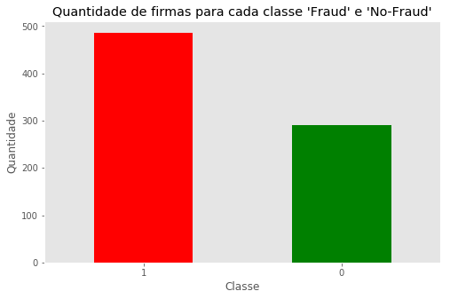
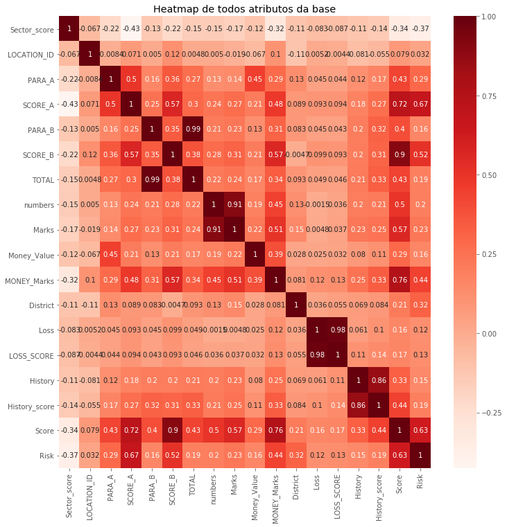
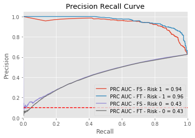
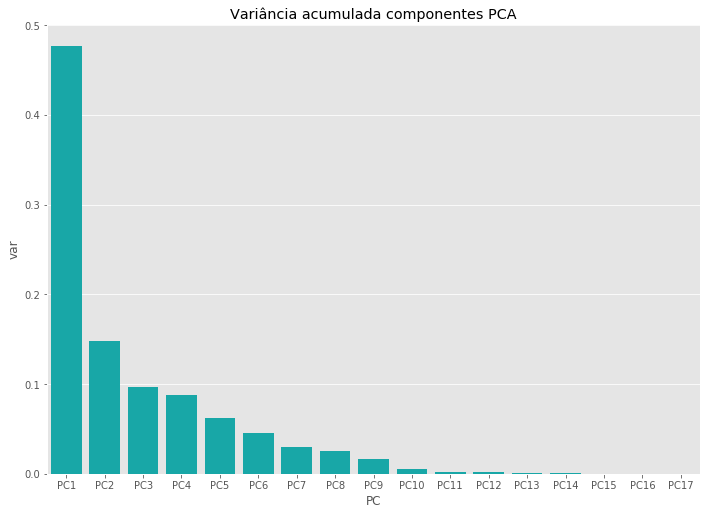
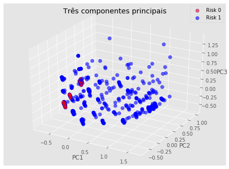
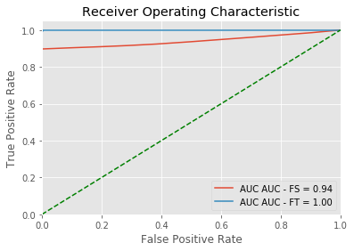
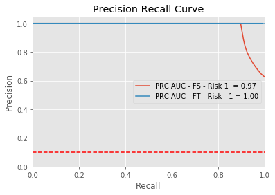

<h1> Caso de estudo sobre a base Audit Dataset </h1>
<hr />
<br>
<p>A base <a href="https://archive.ics.uci.edu/ml/machine-learning-databases/00475/">Audit Dataset</a> apresenta informações
sobre empresas que passaram por uma auditoria pelo <b>Auditor Office of India</b> no período de 2015-2016.</p>

<p>O objetivo da pesquisa é ajudar auditores a construir um modelo de classificação que possa prever empresas que são fraudulentas com base em dados atuais e dados históricos de fatores de risco.</p>

<p>Para desenvolver esse caso de uso foram utilizadas informações presentes no <b><a href="https://archive.ics.uci.edu/ml/datasets/Audit+Data">UCI - Machine Learning Repository</a></b> e no artigo <b><a href="https://doi.org/10.1080/08839514.2018.1451032">Fraudulent Firm Classification: A Case Study of an External Audit.</a></b></p>

<p>As ferramentas de apoio utilizadas neste trabalho foram as bibliotecas python: <b>scikit-learn, pandas, numpy, matplotlib e seaborn</b>. Para apresentação foi utilizado <b>jupyter notebook</b>.</p>

<br>
<br>

O presente caso de estudo é dividido em três partes:
<br>

<ul> <li>Análise de dados e desenvolvimento de uma história</li>
    <ul>
        <li>São analisados o problema abordado pela base, as características de cada um dos atributos: significado,  tipo e valores que assumem. São abordados os problemas que a base possui: atributos com valores de tipos diferentes e valores faltantes, o grau de desbalanceamento da base em relação ao atributo classe </li>
    </ul>
</ul>
<ul><li>Pré-processamento dos dados</li>
    <ul>
        <li>Nesta etapa são utilizadas técnicas para tratar os problemas que a base apresentou durante a análise inicial. Além disso, a base sofre modificações: normalização, seleção de atributos e transformação de atributos. Esta etapa é de extrema importância para se obter resultados expressivos na etapa subsequente que é a classificação.</li>
    </ul>
</ul>
<ul><li>Desenvolvimento de um modelo de Machine Learning</li>
    <ul>
        <li>Nesta etapa é escolhido o algoritmo de classificação e os parâmetros que melhor se adequem ao aprendizado do problema. Aqui, os resultados são analisados estatisticamente por meio de métricas e apresentação de gráficos.
        </li>
    </ul>
</ul>

<h2>1. Análise de dados e desenvolvimento de uma história</h2>
<br>
<p>
O objetivo dessa base, segundo informações obtidas no <b>UCI Machine Learning</b>, é melhorar o processo de auditoria
por meio do uso de Machine Learning. Esse processo é realizado por meio do uso de um classificador para gerar um modelo que classifique uma determinada empresa como fraudulenta ou não.
</p>

<p>Durante esta seção serão abordados a história e a formatação da base sob análise. Os resultados são apresentados nas seguintes subseções:</p>
<br>

<ul>1.1. Descrição da base</ul>
<ul>1.2. Cleaning data</ul>
<ul>1.3. Desbalanceamento do atributo classe </ul>
<ul>1.4. Hipótese levantada pela pesquisa </ul>


<h3>1.1 Descrição da base</h3>

<br>

<p>A base estudada é nomeada como Audit Data. A página do UCI dedicada a base apresenta algumas informações iniciais sobre a base, como por exemplo: </p>

<ul>
    <li>Características dos dados: multivariado</li>
    <li>Características dos atributos: Real</li>
    <li>Número de instâncias: 777</li>
    <li>Número de Atriburos: 18</li>
    <li>Tipo de tarefa: Classificação</li>
    <li>Valores faltando?: Sim</li>
</ul>
<br>

<p>Ao arquivo baixado no repositório veio anexado dois documentos .csv (audit_risk e trial). Ao analisar as características dos arquivos, percebeu-se que o arquivo <b>trial.csv</b> apresentava todas as características apontadas pela descrição do UCI. Por isso, foi considerada como a base de análise o arquivo <b>trial.csv</b>.</p>

<p>Para fins de entendimento do problema e dos atributos presentes na base, foi realizada uma leitura do artigo <b><a href="https://doi.org/10.1080/08839514.2018.1451032">Fraudulent Firm Classification: A Case Study of an External Audit.</a></b>. Porém somente alguns atributos puderam ter seu significado esclarecido com a leitura. Uma descrição de cada atributo é apresentada abaixo:</p>

<br>

<ul><b>Sector_score:</b> score do risco histórico de uma unidade alvo. Uma unidade alvo é alguma das seguintes categoricas:  Irrigation (114), Public Health (77), Buildings and Roads (82), Forest (70), Corporate (47), Animal Husbandry (95), Communication (1), Electrical (4), Land (5), Science and Technology (3), Tourism (1), Fisheries (41), Industries (37), Agriculture (200). Assim sendo, o sector_score seria um valor que descreve o quanto um setor é conhecido historicamente por apresentar empresas com risco de serem fraudulentas.</ul>
<ul><b>Location_ID:</b> Id único da cidade/província</ul>
<ul><b>Para_A:</b> Discrepância encontrada nas despesas previstas no relatória A de inspeção. Essa discrepância é dada em valores monetários, como o estudo é realizado na índia a unidade é o crore (crore - medida 10.000.000 na Índia)</ul>
<ul><b>Score_A:</b> Não foram encontradas informações sobre este atributo. Supõe-se que seja um valor dado ao relatório A.</ul>
<ul><b>Para_B:</b>Discrepância encontrada nas despesas não planejadas no relatório B de inspeção. Essa discrepância também é dada em crore</ul>
<ul><b>Score_B:</b> A mesma dedução realizada com o Score_A</ul>
<ul><b>Total:</b>Total de discrepância encontrada em outros relatórios (in crore)</ul>
<ul><b>Numbers:</b>Score do histórico de discrepância</ul>
<ul><b>Marks:</b> Não foram encontradas informações sobre o atributo e também não foi possível inferir seu significado.</ul>
<ul><b>Money_value:</b>Quantidade de dinheiro envolvido em distorções de valores em auditorias anteriores</ul>
<ul><b>Money_marks:</b>Não foi possível deduzir seu significado</ul>
<ul><b>District:</b>Score do histórico de risco do distrito nos últimos 10 anos</ul>
<ul><b>Loss:</b>Perdas sofridas pela firma no último ano</ul>
<ul><b>Loss_Score:</b> Não foram encontradas informações sobre este atributo. Supõe-se que seja um score dado à perda sofrida pela empresa.</ul>
<ul><b>History:</b>Média histórica de perda sofrida pela empresa nos últimos 10 anos</ul>
<ul><b>History_score:</b> Nenhuma informação concreta sobre este atributo. Supõe-se que seja um score dado ao atributo History.</ul>
<ul><b>Score:</b>Um valor que representa o risco total da empresa.</ul>
<ul><b>Risk:</b> Classe que avalia o risco da firma no caso de auditoria.</ul>

<br>
<p>Abaixo são apresentados a importação de todas as bibliotecas utilizadas nesse caso de uso e uma amostra de 5 registros dos dados do arquivo trial.csv:</p>


```python
#importando bibliotecas necessárias
%matplotlib inline
import pandas as pd
import matplotlib.pyplot as plt
import seaborn as sns
import numpy as np
from sklearn.impute import SimpleImputer
from sklearn.preprocessing import MinMaxScaler
from sklearn.decomposition import PCA
from mpl_toolkits.mplot3d import Axes3D
from sklearn.metrics import classification_report, accuracy_score, confusion_matrix, cohen_kappa_score
from sklearn.model_selection import StratifiedKFold
from sklearn.ensemble import RandomForestClassifier
from sklearn.metrics import roc_curve
from sklearn.metrics import roc_auc_score
from sklearn.metrics import precision_recall_curve
from sklearn.metrics import average_precision_score
plt.style.use('ggplot')
```


```python
#leitura do arquivo
dataset = pd.read_csv('trial.csv')
#apresentação dos 5 primeiros registros
dataset.head()
```


<div>
<style scoped>
    .dataframe tbody tr th:only-of-type {
        vertical-align: middle;
    }

    .dataframe tbody tr th {
        vertical-align: top;
    }

    .dataframe thead th {
        text-align: right;
    }
</style>
<table border="1" class="dataframe">
  <thead>
    <tr style="text-align: right;">
      <th></th>
      <th>Sector_score</th>
      <th>LOCATION_ID</th>
      <th>PARA_A</th>
      <th>SCORE_A</th>
      <th>PARA_B</th>
      <th>SCORE_B</th>
      <th>TOTAL</th>
      <th>numbers</th>
      <th>Marks</th>
      <th>Money_Value</th>
      <th>MONEY_Marks</th>
      <th>District</th>
      <th>Loss</th>
      <th>LOSS_SCORE</th>
      <th>History</th>
      <th>History_score</th>
      <th>Score</th>
      <th>Risk</th>
    </tr>
  </thead>
  <tbody>
    <tr>
      <th>0</th>
      <td>3.89</td>
      <td>23</td>
      <td>4.18</td>
      <td>6</td>
      <td>2.50</td>
      <td>2</td>
      <td>6.68</td>
      <td>5.0</td>
      <td>2</td>
      <td>3.38</td>
      <td>2</td>
      <td>2</td>
      <td>0</td>
      <td>2</td>
      <td>0</td>
      <td>2</td>
      <td>2.4</td>
      <td>1</td>
    </tr>
    <tr>
      <th>1</th>
      <td>3.89</td>
      <td>6</td>
      <td>0.00</td>
      <td>2</td>
      <td>4.83</td>
      <td>2</td>
      <td>4.83</td>
      <td>5.0</td>
      <td>2</td>
      <td>0.94</td>
      <td>2</td>
      <td>2</td>
      <td>0</td>
      <td>2</td>
      <td>0</td>
      <td>2</td>
      <td>2.0</td>
      <td>0</td>
    </tr>
    <tr>
      <th>2</th>
      <td>3.89</td>
      <td>6</td>
      <td>0.51</td>
      <td>2</td>
      <td>0.23</td>
      <td>2</td>
      <td>0.74</td>
      <td>5.0</td>
      <td>2</td>
      <td>0.00</td>
      <td>2</td>
      <td>2</td>
      <td>0</td>
      <td>2</td>
      <td>0</td>
      <td>2</td>
      <td>2.0</td>
      <td>0</td>
    </tr>
    <tr>
      <th>3</th>
      <td>3.89</td>
      <td>6</td>
      <td>0.00</td>
      <td>2</td>
      <td>10.80</td>
      <td>6</td>
      <td>10.80</td>
      <td>6.0</td>
      <td>6</td>
      <td>11.75</td>
      <td>6</td>
      <td>2</td>
      <td>0</td>
      <td>2</td>
      <td>0</td>
      <td>2</td>
      <td>4.4</td>
      <td>1</td>
    </tr>
    <tr>
      <th>4</th>
      <td>3.89</td>
      <td>6</td>
      <td>0.00</td>
      <td>2</td>
      <td>0.08</td>
      <td>2</td>
      <td>0.08</td>
      <td>5.0</td>
      <td>2</td>
      <td>0.00</td>
      <td>2</td>
      <td>2</td>
      <td>0</td>
      <td>2</td>
      <td>0</td>
      <td>2</td>
      <td>2.0</td>
      <td>0</td>
    </tr>
  </tbody>
</table>
</div>


<br>
<p>Olhando para os registros acima, percebe-se que a maioria dos atributos possui informações do tipo inteiro ou ponto flutuante. Ao listar os seus tipos, como demonstrado abaixo, temos a confirmação e um dado curioso. O atributo LOCATION_ID aparece como do tipo <b>object</b>. Isso, em outras palavras, quer dizer que o tipo dele não é definido.</p>
<br>


```python
#apresentando atributos e seus respectivos tipos
dataset.dtypes
```


    Sector_score     float64
    LOCATION_ID       object
    PARA_A           float64
    SCORE_A            int64
    PARA_B           float64
    SCORE_B            int64
    TOTAL            float64
    numbers          float64
    Marks              int64
    Money_Value      float64
    MONEY_Marks        int64
    District           int64
    Loss               int64
    LOSS_SCORE         int64
    History            int64
    History_score      int64
    Score            float64
    Risk               int64
    dtype: object


<br>
<p>Investigando os dados desse atributo específico, como demonstrado no código abaixo, descobriu-se que existem três registros que possuem informação de texto. Como este atributo apresenta um ID de uma localização, acredita-se que para esses casos específicos foi colocado o nome do local. </p>
<p>Para contornar este problema e uniformizar o tipo do atributo, foi analisado qual o maior ID dentre os registros do atributo LOCATION-ID (44) e para cada um dos nomes (LOHARU, NUH, SAFIDON) foi dado um valor subsequente (45,46,47).</p>


```python
#Verificando quais valores da coluna Location_ID não são dígitos e substituindo para o valor subsequente ao máximo
cont = 45
for index, row in dataset.iterrows():
    if not row['LOCATION_ID'].isdigit():
        print("id: " + str(index) + ", row: " + row['LOCATION_ID'])
        dataset.loc[index,'LOCATION_ID'] = cont
        cont += 1
        
#Convertendo coluna Location_ID para int64
dataset["LOCATION_ID"] = pd.to_numeric(dataset["LOCATION_ID"])
```

    id: 351, row: LOHARU
    id: 355, row: NUH
    id: 367, row: SAFIDON
    

<br>
<p>Abaixo é apresentado os atributos e seus respectivos tipos após a alteração</p>


```python
#apresentando atributos e seus respectivos tipos depois da remoção dos registros Location_ID(LOHARU,NUH,SAFIDON)
dataset.dtypes
```


    Sector_score     float64
    LOCATION_ID        int64
    PARA_A           float64
    SCORE_A            int64
    PARA_B           float64
    SCORE_B            int64
    TOTAL            float64
    numbers          float64
    Marks              int64
    Money_Value      float64
    MONEY_Marks        int64
    District           int64
    Loss               int64
    LOSS_SCORE         int64
    History            int64
    History_score      int64
    Score            float64
    Risk               int64
    dtype: object


<br>
<h3>1.2 Cleaning Data</h3>

<br>

<p>A limpeza de dados ou cleaning data, é uma das tarefas mais relevantes na análise de dados. Antes de se realizar qualquer inferência estatística sobre os dados é necessário realizar uma "limpeza". Que nada mais é que uniformizar as informações, como foi realizado com o atributo LOCATION_ID, além de tratar valores ausentes ou nulos, remover atributos não-relevantes para análise, normalizar os dados e etc.</p>
<p>Na descrição da base, logo no início da seção, foi informado que a base apresenta valores faltates. Para saber quais atributos apresentavam esse problema foi utilizado o comando <b>isnull()</b> presente na biblioteca pandas. Os resultados apontam apenas um valor ausente(ou nulo) no atributo Money_Value, como demonstrado logo abaixo: </p>


```python
#verificando valores nulos
dataset.isnull().sum()
```


    Sector_score     0
    LOCATION_ID      0
    PARA_A           0
    SCORE_A          0
    PARA_B           0
    SCORE_B          0
    TOTAL            0
    numbers          0
    Marks            0
    Money_Value      1
    MONEY_Marks      0
    District         0
    Loss             0
    LOSS_SCORE       0
    History          0
    History_score    0
    Score            0
    Risk             0
    dtype: int64


<br>
<h3>1.3. Desbalanceamento do atributo classe</h3>

<br>

<p>O problema do desbalanceamento ocorre quando há uma classe que apresenta um grande número de exemplos, enquanto a outra possui poucos. Isso é um problema muito comum, que acontece em vários domínios de problemas, e é problema porque alguns sistemas de aprendizado assumem que as classes estão balanceadas. Dessa forma, esses sistemas falham ao induzir um classificador que seja capaz de predizer a classe minoritária. </p>
<p> O problema análisado nesse caso de uso, temos que a classe Fraud (1), que indica que a empresa cometeu fraude, possui mais registros que a classe No-Fraud (0), que indica quando a empresa não cometeu fraude. O gráfico abaixo apresenta essa diferença, onde a coluna vermelha representa a Fraud e a verde representa a No-Fraud. A classe Fraud apresenta um pouco menos de 500 registros e a classe No-Fraud aproximadamente 300.</p>
<p> Existem estratégias para contornar esse problema: Undersampling e Oversampling. Que significa, respectivamente, remover registros da classe dominante e inserir mais registros da classe minoritária. Apesar de resolver o problema, essas estratégias possuem desvantagens. A primeira é a remoção de informações da base, porque às vezes podem ser removidas informações importantes. A segunda é a adição de informações duplicadas, essa estratégia pode causar overfitting dependendo do grau de desbalanceamento da base. </p>

<p>Consideram o tamanho total da base (777 registros), que não é muito, e o grau de desbalanceamento, que não é alto, optou-se por não aplicar nenhum tipo de estratégia de desbalanceamento.</p>


```python
#Quantidade de registros para cada classe (Fraud and No-Fraud)
dataset['Risk'].value_counts().head(777).plot(kind='bar', 
                                              figsize=(8,5), 
                                              grid=False, 
                                              rot=0,
                                              color=['red','green'])
                                                                                                  
#Definindo legendas do gráfico
plt.title("Quantidade de firmas para cada classe 'Fraud' e 'No-Fraud'")
plt.xlabel("Classe")
plt.ylabel("Quantidade")
plt.show()                                                    
```





<br>
<h3>1.4. Hipótese levantada pela pesquisa</h3>

<br>

<p>Considerando esta análise inicial dos dados, é possível levantar algumas hipóteses sobre o aprendizado. A principal delas é, se a base e os pré-processamentos realizados nela se mostram suficientes para inferir o risco de uma empresa ser fraudulenta ou não. Para isso é necessário que as métricas de avaliação do classificador sejam favoráveis para aceitar esta hipótese.</p>
<br>

<h2>2. Pré-processamento dos dados</h2>
<br>
<p>Nesta etapa serão realizados algumas transformações na base com o objetivo de melhorá-la para o processo de classificação. Algumas das principais tarefas de pré-processamento são: tratamento de valores desconhecidos, tratamento de classes desbalanceadas, seleção de atributos e transformação de atributos. Neste caso de estudo foram realizados pré-processamentos detalhados nas subseções a seguir:</p>
<ul>2.1. Tratando valores desconhecidos</ul>
<ul>2.2. Normalização</ul>
<ul>2.3. Feature Selection</ul>
<ul>2.4. Feature Transformation</ul>

<br>
<br>
<h3>2.1. Tratando valores desconhecidos</h3>
<br>
<p>Valores desconhecidos ou ausentes consistem no não preenchimento de valores de um atributo para determinados casos. Como foi observado na etapa de Análise dos dados, o atributo Money_Value apresenta um valor ausente. Para resolver esse problema existem várias técnicas, uma das mais comuns é conhecida como Imputação.</p>
<p>A imputação consiste em substituir valores desconhecidos por valores estimados por meio de alguma informação extraída do conjunto de dados. Aqui foi utilizado inputação por média, que consiste em substituir o valor desconhecido pela média dos valores preenchidos para aquele atributo. O resultado desse processo é apresentado nos códigos abaixo:</p>


```python
#Tratando valores nulos com inputation nos dados sem contar o atributo classe

imputer = SimpleImputer(missing_values = np.nan, strategy = 'mean')
imputer = imputer.fit(dataset.iloc[:,:-1])
dataset.iloc[:,:-1] = imputer.transform(dataset.iloc[:,:-1])

```

<br>
<h3>2.2. Normalização</h3>
<br>
<p>A normalização é uma técnica que busca padronizar ou reescalar os dados de maneira que eles estejam na mesma faixa de valores. Para a tarefa de classificação, ter os dados normalizados é um grande auxílio na hora de gerar um modelo que melhor represente os dados. A normalização realizada na base foi a reescala para a faixa de valores entre [0, 1]. Os resultados são apresentados a seguir: </p>


```python
# Aqui são apresentados uma visão geral dos dados. Com destaque para as
# diferentes faixas de valores assumidos por cada atributo
dataset.describe()
```


<div>
<style scoped>
    .dataframe tbody tr th:only-of-type {
        vertical-align: middle;
    }

    .dataframe tbody tr th {
        vertical-align: top;
    }

    .dataframe thead th {
        text-align: right;
    }
</style>
<table border="1" class="dataframe">
  <thead>
    <tr style="text-align: right;">
      <th></th>
      <th>Sector_score</th>
      <th>LOCATION_ID</th>
      <th>PARA_A</th>
      <th>SCORE_A</th>
      <th>PARA_B</th>
      <th>SCORE_B</th>
      <th>TOTAL</th>
      <th>numbers</th>
      <th>Marks</th>
      <th>Money_Value</th>
      <th>MONEY_Marks</th>
      <th>District</th>
      <th>Loss</th>
      <th>LOSS_SCORE</th>
      <th>History</th>
      <th>History_score</th>
      <th>Score</th>
      <th>Risk</th>
    </tr>
  </thead>
  <tbody>
    <tr>
      <th>count</th>
      <td>776.000000</td>
      <td>776.000000</td>
      <td>776.000000</td>
      <td>776.000000</td>
      <td>776.000000</td>
      <td>776.000000</td>
      <td>776.000000</td>
      <td>776.000000</td>
      <td>776.000000</td>
      <td>776.000000</td>
      <td>776.000000</td>
      <td>776.000000</td>
      <td>776.000000</td>
      <td>776.000000</td>
      <td>776.000000</td>
      <td>776.000000</td>
      <td>776.000000</td>
      <td>776.000000</td>
    </tr>
    <tr>
      <th>mean</th>
      <td>20.184536</td>
      <td>14.976804</td>
      <td>2.450194</td>
      <td>3.512887</td>
      <td>10.799988</td>
      <td>3.131443</td>
      <td>13.218481</td>
      <td>5.067655</td>
      <td>2.237113</td>
      <td>14.137631</td>
      <td>2.909794</td>
      <td>2.505155</td>
      <td>0.029639</td>
      <td>2.061856</td>
      <td>0.104381</td>
      <td>2.167526</td>
      <td>2.702577</td>
      <td>0.626289</td>
    </tr>
    <tr>
      <th>std</th>
      <td>24.319017</td>
      <td>10.059923</td>
      <td>5.678870</td>
      <td>1.740549</td>
      <td>50.083624</td>
      <td>1.698042</td>
      <td>51.312829</td>
      <td>0.264449</td>
      <td>0.803517</td>
      <td>66.563533</td>
      <td>1.597452</td>
      <td>1.228678</td>
      <td>0.184280</td>
      <td>0.375080</td>
      <td>0.531031</td>
      <td>0.679869</td>
      <td>0.858923</td>
      <td>0.484100</td>
    </tr>
    <tr>
      <th>min</th>
      <td>1.850000</td>
      <td>1.000000</td>
      <td>0.000000</td>
      <td>2.000000</td>
      <td>0.000000</td>
      <td>2.000000</td>
      <td>0.000000</td>
      <td>5.000000</td>
      <td>2.000000</td>
      <td>0.000000</td>
      <td>2.000000</td>
      <td>2.000000</td>
      <td>0.000000</td>
      <td>2.000000</td>
      <td>0.000000</td>
      <td>2.000000</td>
      <td>2.000000</td>
      <td>0.000000</td>
    </tr>
    <tr>
      <th>25%</th>
      <td>2.370000</td>
      <td>8.000000</td>
      <td>0.210000</td>
      <td>2.000000</td>
      <td>0.000000</td>
      <td>2.000000</td>
      <td>0.537500</td>
      <td>5.000000</td>
      <td>2.000000</td>
      <td>0.000000</td>
      <td>2.000000</td>
      <td>2.000000</td>
      <td>0.000000</td>
      <td>2.000000</td>
      <td>0.000000</td>
      <td>2.000000</td>
      <td>2.000000</td>
      <td>0.000000</td>
    </tr>
    <tr>
      <th>50%</th>
      <td>3.890000</td>
      <td>13.000000</td>
      <td>0.875000</td>
      <td>2.000000</td>
      <td>0.405000</td>
      <td>2.000000</td>
      <td>1.370000</td>
      <td>5.000000</td>
      <td>2.000000</td>
      <td>0.095000</td>
      <td>2.000000</td>
      <td>2.000000</td>
      <td>0.000000</td>
      <td>2.000000</td>
      <td>0.000000</td>
      <td>2.000000</td>
      <td>2.400000</td>
      <td>1.000000</td>
    </tr>
    <tr>
      <th>75%</th>
      <td>55.570000</td>
      <td>19.000000</td>
      <td>2.480000</td>
      <td>6.000000</td>
      <td>4.160000</td>
      <td>4.000000</td>
      <td>7.707500</td>
      <td>5.000000</td>
      <td>2.000000</td>
      <td>5.630000</td>
      <td>4.000000</td>
      <td>2.000000</td>
      <td>0.000000</td>
      <td>2.000000</td>
      <td>0.000000</td>
      <td>2.000000</td>
      <td>3.250000</td>
      <td>1.000000</td>
    </tr>
    <tr>
      <th>max</th>
      <td>59.850000</td>
      <td>47.000000</td>
      <td>85.000000</td>
      <td>6.000000</td>
      <td>1264.630000</td>
      <td>6.000000</td>
      <td>1268.910000</td>
      <td>9.000000</td>
      <td>6.000000</td>
      <td>935.030000</td>
      <td>6.000000</td>
      <td>6.000000</td>
      <td>2.000000</td>
      <td>6.000000</td>
      <td>9.000000</td>
      <td>6.000000</td>
      <td>5.200000</td>
      <td>1.000000</td>
    </tr>
  </tbody>
</table>
</div>


```python
#Normalizando bases
scaler = MinMaxScaler().fit(dataset.iloc[:,:-1])
dataset.iloc[:,:-1] = scaler.transform(dataset.iloc[:,:-1])

np.set_printoptions(precision=3)
```


```python
#Apresentação de uma amostra dos dados normalizados
dataset.head()
```


<div>
<style scoped>
    .dataframe tbody tr th:only-of-type {
        vertical-align: middle;
    }

    .dataframe tbody tr th {
        vertical-align: top;
    }

    .dataframe thead th {
        text-align: right;
    }
</style>
<table border="1" class="dataframe">
  <thead>
    <tr style="text-align: right;">
      <th></th>
      <th>Sector_score</th>
      <th>LOCATION_ID</th>
      <th>PARA_A</th>
      <th>SCORE_A</th>
      <th>PARA_B</th>
      <th>SCORE_B</th>
      <th>TOTAL</th>
      <th>numbers</th>
      <th>Marks</th>
      <th>Money_Value</th>
      <th>MONEY_Marks</th>
      <th>District</th>
      <th>Loss</th>
      <th>LOSS_SCORE</th>
      <th>History</th>
      <th>History_score</th>
      <th>Score</th>
      <th>Risk</th>
    </tr>
  </thead>
  <tbody>
    <tr>
      <th>0</th>
      <td>0.035172</td>
      <td>0.478261</td>
      <td>0.049176</td>
      <td>1.0</td>
      <td>0.001977</td>
      <td>0.0</td>
      <td>0.005264</td>
      <td>0.00</td>
      <td>0.0</td>
      <td>0.003615</td>
      <td>0.0</td>
      <td>0.0</td>
      <td>0.0</td>
      <td>0.0</td>
      <td>0.0</td>
      <td>0.0</td>
      <td>0.125</td>
      <td>1</td>
    </tr>
    <tr>
      <th>1</th>
      <td>0.035172</td>
      <td>0.108696</td>
      <td>0.000000</td>
      <td>0.0</td>
      <td>0.003819</td>
      <td>0.0</td>
      <td>0.003806</td>
      <td>0.00</td>
      <td>0.0</td>
      <td>0.001005</td>
      <td>0.0</td>
      <td>0.0</td>
      <td>0.0</td>
      <td>0.0</td>
      <td>0.0</td>
      <td>0.0</td>
      <td>0.000</td>
      <td>0</td>
    </tr>
    <tr>
      <th>2</th>
      <td>0.035172</td>
      <td>0.108696</td>
      <td>0.006000</td>
      <td>0.0</td>
      <td>0.000182</td>
      <td>0.0</td>
      <td>0.000583</td>
      <td>0.00</td>
      <td>0.0</td>
      <td>0.000000</td>
      <td>0.0</td>
      <td>0.0</td>
      <td>0.0</td>
      <td>0.0</td>
      <td>0.0</td>
      <td>0.0</td>
      <td>0.000</td>
      <td>0</td>
    </tr>
    <tr>
      <th>3</th>
      <td>0.035172</td>
      <td>0.108696</td>
      <td>0.000000</td>
      <td>0.0</td>
      <td>0.008540</td>
      <td>1.0</td>
      <td>0.008511</td>
      <td>0.25</td>
      <td>1.0</td>
      <td>0.012566</td>
      <td>1.0</td>
      <td>0.0</td>
      <td>0.0</td>
      <td>0.0</td>
      <td>0.0</td>
      <td>0.0</td>
      <td>0.750</td>
      <td>1</td>
    </tr>
    <tr>
      <th>4</th>
      <td>0.035172</td>
      <td>0.108696</td>
      <td>0.000000</td>
      <td>0.0</td>
      <td>0.000063</td>
      <td>0.0</td>
      <td>0.000063</td>
      <td>0.00</td>
      <td>0.0</td>
      <td>0.000000</td>
      <td>0.0</td>
      <td>0.0</td>
      <td>0.0</td>
      <td>0.0</td>
      <td>0.0</td>
      <td>0.0</td>
      <td>0.000</td>
      <td>0</td>
    </tr>
  </tbody>
</table>
</div>


<br>
<h3>2.3. Feature Selection (Seleção de atributos)</h3>
<br>
<p>A seleção de atributos é uma técnica que consiste em escolher um conjunto M de atrubutos de um conjunto original N, onde M &le; N. Já é comprovado que alguns algoritmos de classificação não trabalham bem quando há dados redundantes ou irrelevantes. Sendo assim, a fim de reduzir esses atributos irrelevantes e redundantes foi realizado foi utilizado uma técnica de seleção de atributos baseada na correlação dos atributos.</p>
<p>Na seleção de atributos baseada em correlação, busca-se atributos que estejam fortemente correlacionados com o atributo classe e fracamente correlacionados entre si. Neste trabalho foi utilizada a correlação de Pearson. Inicialmente é apresentado um heatmap com a correlação de todos os atributos do problema. Nele é possível observar que quanto mais correlacionado é um atributo em relação a outro, maior é a tonalidade no mapa. Para selecionar os atributos com maior correlação com o atributo classe Risk é usado um threshold de 0.4, ou seja, só serão selecionados os atributos cuja correlação for maior ou igua a 0.4. Os atributos selecionados são apresentados a seguir:</p>


```python
# Medindo a correlação dos atributos com o atributo classe 'Risk'
# Mapa de calor baseado na correlação de Pearson
plt.figure(figsize=(12,12))
plt.title("Heatmap de todos atributos da base")
cor = dataset.corr()
sns.heatmap(cor, annot=True, cmap=plt.cm.Reds)
plt.show()

cor_target = abs(cor["Risk"])

#Selecting highly correlated features
relevant_features = cor_target[cor_target>=0.4]
relevant_features

```





    SCORE_A        0.671863
    SCORE_B        0.515045
    MONEY_Marks    0.440226
    Score          0.632268
    Risk           1.000000
    Name: Risk, dtype: float64


<p>Depois de selecionado os principais atributos correlacionados ao atributo classe, é apresentado um heatmap dos atributos correlacionados entre si. Segundo o gráfico apresentado abaixo o atributo Score apresenta forte correlação com todos os outros atributos, desta forma ele foi removido do conjunto final de atributos. Desta forma, a base final (base_fs) possuem como atributos: SCORE_A,SCORE_B, MONEY_Marks e Risk</p>


```python
# Correlação entre os atributos correlacionados com o atributo classe
plt.figure(figsize=(6,6))
plt.title("Heatmap dos atributos correlacionados a classe")
sns.heatmap(dataset[["SCORE_A","SCORE_B","MONEY_Marks", "Score"]].corr(), annot=True, cmap=plt.cm.Reds)
plt.show()
print(dataset[["SCORE_A","SCORE_B","MONEY_Marks", "Score"]].corr())
```





                  SCORE_A   SCORE_B  MONEY_Marks     Score
    SCORE_A      1.000000  0.572655     0.478876  0.720488
    SCORE_B      0.572655  1.000000     0.567591  0.901276
    MONEY_Marks  0.478876  0.567591     1.000000  0.758327
    Score        0.720488  0.901276     0.758327  1.000000
    


```python
# Na seleção de atributos se busca atributos que sejam independentes
# entre si e muito correlacionados com o atributo classe. 
# Os atributos SCORE_A, SCORE_B, MONEY_Marks e Score possuem forte
# correlação com o atributo classe 'Risk' porém entre si, o atributo 
# Score possui forte correlação com todos os outros atributos, ou seja a
# sua remoção do conjunto final de atributos traz menos redundância
# para a base
# Aqui removemos o atributo Score e deixamos a 
# base final com os seguintes atributos: 

base_fs = dataset[["SCORE_A","SCORE_B","MONEY_Marks","Risk"]]
base_fs.head()
```


<div>
<style scoped>
    .dataframe tbody tr th:only-of-type {
        vertical-align: middle;
    }

    .dataframe tbody tr th {
        vertical-align: top;
    }

    .dataframe thead th {
        text-align: right;
    }
</style>
<table border="1" class="dataframe">
  <thead>
    <tr style="text-align: right;">
      <th></th>
      <th>SCORE_A</th>
      <th>SCORE_B</th>
      <th>MONEY_Marks</th>
      <th>Risk</th>
    </tr>
  </thead>
  <tbody>
    <tr>
      <th>0</th>
      <td>1.0</td>
      <td>0.0</td>
      <td>0.0</td>
      <td>1</td>
    </tr>
    <tr>
      <th>1</th>
      <td>0.0</td>
      <td>0.0</td>
      <td>0.0</td>
      <td>0</td>
    </tr>
    <tr>
      <th>2</th>
      <td>0.0</td>
      <td>0.0</td>
      <td>0.0</td>
      <td>0</td>
    </tr>
    <tr>
      <th>3</th>
      <td>0.0</td>
      <td>1.0</td>
      <td>1.0</td>
      <td>1</td>
    </tr>
    <tr>
      <th>4</th>
      <td>0.0</td>
      <td>0.0</td>
      <td>0.0</td>
      <td>0</td>
    </tr>
  </tbody>
</table>
</div>


<br>
<h3>2.4. Feature Transformation (Transformação de atributos)</h3>
<br>
<p>A transformação de atributos busca gerar um novo conjunto de atributos em relação ao original por meio de uma função de mapeamento. Esse novo conjunto pode ser menor ou igual ao conjunto original. Essa técnica pode ser utilizada no contexto de redução da complexidade dos dados. Uma das técnicas mais populares de transformação de atributos é o PCA (Principal Component Analysis).</p>
<p>A ideia do principal component analysis é usar um sistema de coordenadas especial
para estruturar a ’nuvem’ de pontos em uma forma menos complexa, para isso é realizado
uma transformação no sistema de coordenadas. Esta transformação acontece da seguinte
forma: o primeiro eixo é colocado na direção de maior variância de pontos para maximizar
a variância ao longo do eixo. Os outros eixos são colocados sempre perpendicular ao
primeiro, onde cada um é colocado de maneira a maximizar sua partição na variância
restante.</p>
<p>Neste trabalho foi utilizado PCA modelado com 17 componentes (número de atributos menos o atributo classe). O resultado da transformação pode ser acompanhado a seguir:</p>


```python
# Feature transformation com PCA
pca = PCA(n_components = 17)
# pca = KernelPCA(n_components=17, kernel='linear')
array = dataset.values
X = array[:,:-1]
base_transform = pca.fit_transform(X)

# Transformação da base final pca para dataframe
base_pca = pd.DataFrame(data = base_transform , 
        columns = ['PC1', 'PC2','PC3','PC4','PC5','PC6','PC7','PC8','PC9','PC10','PC11','PC12','PC13','PC14','PC15',
                   'PC16','PC17'])
base_pca['Risk'] = dataset.iloc[:,17]
base_pca.head()
```


<div>
<style scoped>
    .dataframe tbody tr th:only-of-type {
        vertical-align: middle;
    }

    .dataframe tbody tr th {
        vertical-align: top;
    }

    .dataframe thead th {
        text-align: right;
    }
</style>
<table border="1" class="dataframe">
  <thead>
    <tr style="text-align: right;">
      <th></th>
      <th>PC1</th>
      <th>PC2</th>
      <th>PC3</th>
      <th>PC4</th>
      <th>PC5</th>
      <th>PC6</th>
      <th>PC7</th>
      <th>PC8</th>
      <th>PC9</th>
      <th>PC10</th>
      <th>PC11</th>
      <th>PC12</th>
      <th>PC13</th>
      <th>PC14</th>
      <th>PC15</th>
      <th>PC16</th>
      <th>PC17</th>
      <th>Risk</th>
    </tr>
  </thead>
  <tbody>
    <tr>
      <th>0</th>
      <td>0.117470</td>
      <td>-0.470756</td>
      <td>-0.391607</td>
      <td>0.344600</td>
      <td>-0.340776</td>
      <td>0.172441</td>
      <td>0.075021</td>
      <td>0.010739</td>
      <td>-0.009184</td>
      <td>-0.001569</td>
      <td>0.003519</td>
      <td>-0.011206</td>
      <td>0.001312</td>
      <td>-0.001673</td>
      <td>0.000653</td>
      <td>-0.000039</td>
      <td>-4.390429e-17</td>
      <td>1</td>
    </tr>
    <tr>
      <th>1</th>
      <td>-0.458060</td>
      <td>-0.371550</td>
      <td>-0.050975</td>
      <td>-0.215520</td>
      <td>0.129358</td>
      <td>-0.220868</td>
      <td>-0.007269</td>
      <td>-0.021940</td>
      <td>-0.011421</td>
      <td>-0.001700</td>
      <td>0.009039</td>
      <td>0.001413</td>
      <td>-0.003604</td>
      <td>0.002360</td>
      <td>0.000192</td>
      <td>0.000025</td>
      <td>3.675286e-16</td>
      <td>0</td>
    </tr>
    <tr>
      <th>2</th>
      <td>-0.457979</td>
      <td>-0.371652</td>
      <td>-0.051104</td>
      <td>-0.215178</td>
      <td>0.129231</td>
      <td>-0.220805</td>
      <td>-0.007473</td>
      <td>-0.022152</td>
      <td>-0.011398</td>
      <td>0.000774</td>
      <td>0.005037</td>
      <td>0.007569</td>
      <td>-0.004189</td>
      <td>0.002362</td>
      <td>0.000174</td>
      <td>0.000022</td>
      <td>-9.757309e-17</td>
      <td>0</td>
    </tr>
    <tr>
      <th>3</th>
      <td>0.918501</td>
      <td>0.382874</td>
      <td>0.418988</td>
      <td>-0.860804</td>
      <td>0.295491</td>
      <td>-0.366458</td>
      <td>0.550721</td>
      <td>-0.408802</td>
      <td>0.057868</td>
      <td>-0.058593</td>
      <td>-0.031683</td>
      <td>0.038395</td>
      <td>-0.027601</td>
      <td>-0.046471</td>
      <td>-0.003321</td>
      <td>-0.000204</td>
      <td>-4.328666e-16</td>
      <td>1</td>
    </tr>
    <tr>
      <th>4</th>
      <td>-0.458260</td>
      <td>-0.371637</td>
      <td>-0.051077</td>
      <td>-0.215473</td>
      <td>0.129345</td>
      <td>-0.220751</td>
      <td>-0.007339</td>
      <td>-0.022189</td>
      <td>-0.011285</td>
      <td>-0.002828</td>
      <td>0.004014</td>
      <td>0.002880</td>
      <td>-0.004109</td>
      <td>0.002570</td>
      <td>0.000124</td>
      <td>0.000023</td>
      <td>1.567926e-16</td>
      <td>0</td>
    </tr>
  </tbody>
</table>
</div>


<p>Uma das características principais do PCA é que as primeiras componentes maximizam a variância total dos dados. Desta forma, as componentes de maior índice podem ser removidas sem ter uma perda significativa de informação. Abaixo é mostrado que as primeiras 9 componentes acumulam sozinhas 98% da variância dos dados. Desta forma, foram removidas as componentes restantes. Os resultados são mostrados abaixo:</p>


```python
# Variância acumulada de cada componente
print("As 9 primeiras componentes acumulam aproximadamente 98% "
      "da variância")
print(sum(pca.explained_variance_ratio_[:-8]))
var_acc = pd.DataFrame({'var':pca.explained_variance_ratio_,
             'PC':['PC1', 'PC2','PC3','PC4','PC5','PC6','PC7',
                   'PC8','PC9','PC10','PC11','PC12','PC13','PC14',
                   'PC15','PC16','PC17']})

# plotando variância acumulada de cada componente
dims = (11.7, 8.27)
fig, ax = plt.subplots(figsize=dims)
plt.title('Variância acumulada componentes PCA')
sns.barplot(x='PC',y="var", 
           data=var_acc, color="c", ax=ax)
```

    As 9 primeiras componentes acumulam aproximadamente 98% da variância
    0.9886512453604841
    


    <matplotlib.axes._subplots.AxesSubplot at 0x1690a4d6ac8>





```python
# plotando os dados em um plano para cada uma das três componentes
#  data=base_pca, 
#  fit_reg=False, 
#  hue='Risk', # color by cluster
#  legend=True,
#  scatter_kws={"s": 80})

fig = plt.figure(figsize=(8, 6))
ax = fig.add_subplot(111, projection='3d')

verify_0 = base_pca['Risk'] == 0
verify_1 = base_pca['Risk'] == 1

ax.scatter(base_pca[verify_0]['PC1'], base_pca[verify_0]['PC2'], 
           base_pca[verify_0]['PC3'], s=50, alpha=0.6, c='red', 
           label='Risk 0', edgecolors='b')
ax.scatter(base_pca[verify_1]['PC1'], base_pca[verify_1]['PC2'], 
           base_pca[verify_1]['PC3'], s=50, alpha=0.6, c='blue', 
           label='Risk 1', edgecolors='b')

ax.legend()

ax.set_xlabel('PC1')
ax.set_ylabel('PC2')
ax.set_zlabel('PC3')

plt.title("Três componentes principais")
plt.show()

# Base com transformação PCA
base_tf = base_pca[['PC1','PC2','PC3','PC4','PC5','PC6','PC7','PC8','PC9','Risk']]
base_tf.head()
```





<div>
<style scoped>
    .dataframe tbody tr th:only-of-type {
        vertical-align: middle;
    }

    .dataframe tbody tr th {
        vertical-align: top;
    }

    .dataframe thead th {
        text-align: right;
    }
</style>
<table border="1" class="dataframe">
  <thead>
    <tr style="text-align: right;">
      <th></th>
      <th>PC1</th>
      <th>PC2</th>
      <th>PC3</th>
      <th>PC4</th>
      <th>PC5</th>
      <th>PC6</th>
      <th>PC7</th>
      <th>PC8</th>
      <th>PC9</th>
      <th>Risk</th>
    </tr>
  </thead>
  <tbody>
    <tr>
      <th>0</th>
      <td>0.117470</td>
      <td>-0.470756</td>
      <td>-0.391607</td>
      <td>0.344600</td>
      <td>-0.340776</td>
      <td>0.172441</td>
      <td>0.075021</td>
      <td>0.010739</td>
      <td>-0.009184</td>
      <td>1</td>
    </tr>
    <tr>
      <th>1</th>
      <td>-0.458060</td>
      <td>-0.371550</td>
      <td>-0.050975</td>
      <td>-0.215520</td>
      <td>0.129358</td>
      <td>-0.220868</td>
      <td>-0.007269</td>
      <td>-0.021940</td>
      <td>-0.011421</td>
      <td>0</td>
    </tr>
    <tr>
      <th>2</th>
      <td>-0.457979</td>
      <td>-0.371652</td>
      <td>-0.051104</td>
      <td>-0.215178</td>
      <td>0.129231</td>
      <td>-0.220805</td>
      <td>-0.007473</td>
      <td>-0.022152</td>
      <td>-0.011398</td>
      <td>0</td>
    </tr>
    <tr>
      <th>3</th>
      <td>0.918501</td>
      <td>0.382874</td>
      <td>0.418988</td>
      <td>-0.860804</td>
      <td>0.295491</td>
      <td>-0.366458</td>
      <td>0.550721</td>
      <td>-0.408802</td>
      <td>0.057868</td>
      <td>1</td>
    </tr>
    <tr>
      <th>4</th>
      <td>-0.458260</td>
      <td>-0.371637</td>
      <td>-0.051077</td>
      <td>-0.215473</td>
      <td>0.129345</td>
      <td>-0.220751</td>
      <td>-0.007339</td>
      <td>-0.022189</td>
      <td>-0.011285</td>
      <td>0</td>
    </tr>
  </tbody>
</table>
</div>


<h2>3. Classificação</h2>
<br>
<p>Nesta etapa são detalhados os resultados de classificação para as bases retornadas pelo feature selection e transformation. A tarefa de classificação consiste em dividir os dados em grupos de classes de acordo com os valores de seus atributos. Os registros são agrupados de acordo com um atributo alvo, denomidado de classe, que determina em qual região de decisão está o registro. Esta seção está subdividida nas seguintes subseções:</p>
<ul>3.1. Classificador Random Forest</ul>
<ul>3.2. Métricas de avaliação</ul>
<ul>3.3. Resultados Curva ROC e Precision-Recall</ul>
<ul>3.4. Conclusão</ul>

<br>
<h3>3.1. Classificador Random Forest</h3>
<br>
<p>O algoritmo Random Forest (RF) pode ser entendido como uma combinação de diversas árvores de decisão, onde cada árvore é gerada a partir de amostras selecionadas aleatoriamente do conjunto de dados da base. Após a geração de um grande número de árvores, as classes com maior número de votos são eleitas.</p>

<br>
<h3>3.2. Métricas de avaliação</h3>
<br>
<p>A fim de avaliar os resultados obtidos por um classificador, é comum utilizar métodos de avaliação. Na literatura, a maioria das métricas de avaliação partem da Matriz de Confusão. Para um problema de classificação binária, como é o caso da base sob análise, a matriz de confusão é uma tabela que mostra o resultado da classificação, indicando
a quantidade classificações corretas e incorretas. A matriz é composta por 4 valores: Verdadeiro Positivo (VP ou TP), Verdadeiro Negativo (VN ou TN), Falso Positivo (FP) e Falso Negativo(FN).</p>

<p>A partir desses valores é possível calcular outras métricas, tais como: Precisão (P), Recall(R), Acurácia(A), Área sob a curva ROC (AUC), Área sob a curva Precision-Recall e índice Kappa (K)</p>

<ul>
    <li><b>Precisão(P):</b>reflete a proporção de verdadeiros positivos em relação a todas as predições positivas. A precisão de uma classificação mostra a quantidade de objetos da classe X classificados corretamente em relação a todos os objetos classificados como sendo da classe X.</li>
    <li><b>Recall(R):</b>reflete a proporção de verdadeiros positivos em relação a suas predições positivas e as suas incorretas predições negativas. Essa medida mostra o comportamento dos objetos classificados como X, ou seja, de todos os objetos da classe X, quantos foram classificados como X.</li>
    <li><b>Acurácia(A):</b>é a porcentagem de casos corretamente classificados em um conjunto de teste. Essa medida mede o quão bem um classificador reconhece instâncias de diversas classes.</li>
    <li><b>Kappa (K):</b>é utilizado como medida de exatidão por representar inteiramente a matriz de confusão. Este índice toma todos os elementos da matriz em consideração, em vez de apenas aqueles que retratam a quantidade de classificações verdadeiras, o que ocorre quando de calcula a exatidão global da classificação. Qualidade do classificador de acordo com a índice Kappa: K &le;0.2 (Ruim), 0.2 &le; K &le; 0.4 (Razoável), 0.4 &le; K &le; 0.6 (Bom), 0.6 &le;K &le; 0.8 (Muito Bom), K &be; 0.8 (Excelente).</li>
    
</ul>

<p> O Random Forest foi configurado com 500 estimadores e os testes foram realizados utilizando a técnica 10-fold cross-validation. Abaixo são apresentados os resultados do classificador Random forest para as bases: base_fs(Seleção de Atributos) e base_tf (Transformação de atributos)</p>


```python
# Temos três bases para testar: base_fs e base_tf
# Será aplicado o algoritmo de classificação Random Forest 
# com n_estimators=500 10-fold cross validation

seed = 5
np.random.seed(seed)

# 1 - Primeiro teste com a base normalizada e seleção de atributos 
# (base_fs)

X = base_fs.iloc[:,:-1].values
y = base_fs.iloc[:,3].values

previsores_fs = X
classe_fs = y

kfold = StratifiedKFold(n_splits=10, shuffle=True, random_state=seed)

y_pred_fs = []
y_true_fs = []
probs_fs = []

for indice_treinamento, indice_teste in kfold.split(previsores_fs, np.zeros(shape = (classe_fs.shape[0],1))):
    clf = RandomForestClassifier(n_estimators=500, max_depth=None, random_state=seed)
    clf.fit(previsores_fs[indice_treinamento], classe_fs[indice_treinamento])
    
    resultado = clf.predict(previsores_fs[indice_teste])
    probs = clf.predict_proba(previsores_fs[indice_teste])
    
    p = [x for x in resultado]
    t = [x for x in classe_fs[indice_teste]]
    pr = [list(x) for x in probs]
    
    probs_fs += pr
    y_pred_fs += p
    y_true_fs += t

print("Resultados para Feature Selection\n")

print('Acurácia: ' + str(accuracy_score(y_true_fs, y_pred_fs)))
print('Kappa index: ' + str(cohen_kappa_score(y_true_fs, y_pred_fs)))

target_names = ['Fraud', 'No-Fraud']
label_names = [1, 0]
print(classification_report(y_true_fs, y_pred_fs, labels=label_names, target_names=target_names))

print("Matriz de Confusão\n")
tn, fp, fn, tp = confusion_matrix(y_true_fs, y_pred_fs).ravel()
print("(TN FP FN TP) = (" + str(tn) + "," + str(fp) + "," + str(fn) + "," + str(tp) + ")")
```

    Resultados para Feature Selection
    
    Acurácia: 0.9355670103092784
    Kappa index: 0.8669775095995611
                  precision    recall  f1-score   support
    
           Fraud       1.00      0.90      0.95       486
        No-Fraud       0.85      1.00      0.92       290
    
       micro avg       0.94      0.94      0.94       776
       macro avg       0.93      0.95      0.93       776
    weighted avg       0.95      0.94      0.94       776
    
    Matriz de Confusão
    
    (TN FP FN TP) = (290,0,50,436)
    

<p> Os resultados da classificação para a base_fs apontam uma acurácia de 93%, onde somente 50 registros foram classificados erroneamente. Pela matriz de confusão é possível ver que os 50 registros classificados erronamente pertencem ao FN. Ou seja, 50 registros foram classificados como No-Fraud quando na verdade deveriam ser da classe Fraud. O classificador não cometeu erro do tipo FP, o que significa que ele não cometeu o erro de classificar como Fraud um registro que era No-Fraud. Pelo índice Kappa temos um resultado acima de 0.8 o que configura um resultado excelente.</p>


```python
# 2 - Primeiro teste com a base normalizada e seleção de atributos (base_tf)

X = base_tf.iloc[:,:-1].values
y = base_tf.iloc[:,9].values

previsores_tf = X
classe_tf = y

kfold = StratifiedKFold(n_splits=10, shuffle=True, random_state=seed)

y_pred_tf = []
y_true_tf = []
probs_tf = []

for indice_treinamento, indice_teste in kfold.split(previsores_tf, np.zeros(shape = (classe_tf.shape[0],1))):
    clf = RandomForestClassifier(n_estimators=500, max_depth=None, random_state=seed)
    clf.fit(previsores_tf[indice_treinamento], classe_tf[indice_treinamento])
    
    resultado = clf.predict(previsores_tf[indice_teste])
    probs = clf.predict_proba(previsores_tf[indice_teste])
    
    p = [x for x in resultado]
    t = [x for x in classe_tf[indice_teste]]
    pr = [list(x) for x in probs]
    
    probs_tf += pr
    y_pred_tf += p
    y_true_tf += t

print("Resultados para Feature Transformation com PCA\n")

print('Acurácia: ' + str(accuracy_score(y_true_tf, y_pred_tf)))
print('Kappa index: ' + str(cohen_kappa_score(y_true_tf, y_pred_tf)))

target_names = ['Fraud', 'No-Fraud']
label_names = [1, 0]
print(classification_report(y_true_tf, y_pred_tf, labels=label_names, target_names=target_names))

print("Matriz de Confusão\n")
tn, fp, fn, tp = confusion_matrix(y_true_tf, y_pred_tf).ravel()
print("(TN FP FN TP) = (" + str(tn) + "," + str(fp) + "," + str(fn) + "," + str(tp) + ")")
```

    Resultados para Feature Transformation com PCA
    
    Acurácia: 0.9987113402061856
    Kappa index: 0.9972451399440507
                  precision    recall  f1-score   support
    
           Fraud       1.00      1.00      1.00       486
        No-Fraud       1.00      1.00      1.00       290
    
       micro avg       1.00      1.00      1.00       776
       macro avg       1.00      1.00      1.00       776
    weighted avg       1.00      1.00      1.00       776
    
    Matriz de Confusão
    
    (TN FP FN TP) = (289,1,0,486)
    

<p> Os resultados da classificação para a base_tf apontam uma acurácia de 99%, onde somente 1 registro foi classificado erroneamente. Pela matriz de confusão é possível ver que o registro classificado erronamente pertence ao FP. Ou seja, o registro foi classificado como Fraud quando na verdade deveria ser Fraud. O classificador não cometeu erro do tipo FN, o que significa que ele não cometeu o erro de classificar como No-Fraud um registro que era Fraud. Pelo índice Kappa temos um resultado acima de 0.8 o que configura um resultado excelente.</p>

<br>
<h3>3.3. Resultados Curva ROC e Precision-Recall</h3>
<br>
<p>A curva ROC relaciona TPR (True positive rate) com FPR (False positive rate). Em outras palavras ele relaciona sensibilidade do modelo com os falso positivos. A área roc para um resultado bom é aquele cuja curva mais se aproxime do canto superior esquerdo do gráfico. No resultado apresentado abaixo, temos que curva para o resultado FT (Feature Transformation) foi quase o ideal pois só teve um registro classificado erroneamente. Ao contrário do resultado da base_fs que apresentou mais registros classificados erroneamente. </p>


```python
# Curva ROC para base_fs e base_tf

# ROC CURVE FEATURE SELECTION AND FEATURE TRANSFORMATION

plt.title('Receiver Operating Characteristic')
metodos = ['AUC - FS', 'AUC - FT']

prob_0 = np.asarray(probs_fs)
prob_1 = np.asarray(probs_tf)

for i in range(0, 2):
    if i == 0:
        roc_auc = roc_auc_score(y_true_fs, prob_0[:, 1])
        fpr, tpr, thresholds = roc_curve(y_true_fs, prob_0[:,1])
    else:
        roc_auc = roc_auc_score(y_true_tf, prob_1[:, 1])
        fpr, tpr, thresholds = roc_curve(y_true_tf, prob_1[:,1])
    plt.plot(fpr, tpr, linestyle='-',label = 'AUC ' + str(metodos[i]) + ' = %0.2f' % roc_auc)
plt.legend(loc = 'lower right')
plt.plot([0, 1], [0, 1],'g--')
plt.xlim([0, 1])
plt.ylim([0, 1.05])
plt.ylabel('True Positive Rate')
plt.xlabel('False Positive Rate')
plt.show()
```





A curva ROC relaciona Precision (Precisão) com Recall. A área PR para um resultado bom é aquele cuja curva mais se aproxime do canto superior direito do gráfico. No resultado apresentado abaixo, temos que curva para o resultado FT (Feature Transformation) foi o ideal pois tanto o precision quanto o recall aproximados deram valor igual a 1. Já a curva PR para a base_fs apresentou declíneo da devido aos resultados de precision e recall apresentados anteriormente. 


```python
# Curva ROC para base_fs e base_tf

# Precision-Recall CURVE FEATURE SELECTION AND FEATURE TRANSFORMATION

plt.title('Precision Recall Curve')
metodos = ['AUC - FS - Risk 1 ', 'AUC - FT - Risk - 1', 'AUC - FS - Risk 0 ', 'AUC - FT - Risk - 0']

prob_0 = np.asarray(probs_fs)
prob_1 = np.asarray(probs_tf)

for i in range(0, 2):
    if i == 0:
        p, r, thresholds = precision_recall_curve(y_true_fs, prob_0[:, 1])
        av_pred = average_precision_score(y_true_fs, prob_0[:, 1])
    else:
        p, r, thresholds = precision_recall_curve(y_true_tf, prob_1[:, 1])
        av_pred = average_precision_score(y_true_tf, prob_1[:, 1])
        
    plt.plot(r, p, linestyle='-', label = 'PRC ' +str(metodos[i]) + ' = %0.2f' % av_pred)
plt.legend(loc = 'best')
plt.plot([0, 1], [0.1, 0.1], 'r--')
plt.xlim([0, 1])
plt.ylim([0, 1.05])
plt.ylabel('Precision')
plt.xlabel('Recall')
plt.show()
```





<br>
<h3>3.4. Conclusão</h3>
<br>
<p>A partir dos resultados apresentados, pode-se concluir que o modelo de classificação proposto foi bem sucedido em desenvolver um modelo de predição. Isso é demonstrado pelos resultados das métricas de avaliação, que, para ambas as abordagens, seleção e transformação de atributos, apresentou resultados satisfatórios com mais 90 % de acurácia, precision, recall próximos de 1 e índice kappa acima de 0.8. A partir dos resultados também é possível observar que a abordagem com transformação de atributos teve resultados superiores aos de seleção de atributos.</p>


```python

```
