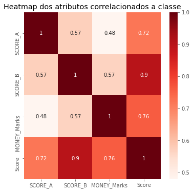

<h1> Caso de estudo sobre a base Audit Dataset </h1>
<br>
<p>A base <a href="https://archive.ics.uci.edu/ml/machine-learning-databases/00475/">Audit Dataset</a> apresenta informações
sobre empresas que passaram por uma auditoria pelo <b>Auditor Office of India</b> no período de 2015-2016.</p>

<p>O objetivo da pesquisa é ajudar auditores a construir um modelo de classificação que possa prever empresas que são fraudulentas com base em dados atuais e dados históricos de fatores de risco.</p>

<p>Para desenvolver esse caso de uso foram utilizadas informações presentes no <b><a href="https://archive.ics.uci.edu/ml/datasets/Audit+Data">UCI - Machine Learning Repository</a></b> e no artigo <b><a href="https://doi.org/10.1080/08839514.2018.1451032">Fraudulent Firm Classification: A Case Study of an External Audit.</a></b></p>

<p>As ferramentas de apoio utilizadas neste trabalho foram as bibliotecas python: <b>scikit-learn, pandas, numpy, matplotlib e seaborn</b>. Para apresentação foi utilizado <b>jupyter notebook</b>.</p>

<br>
<br>

O presente caso de estudo é dividido em três partes:
<br>

<ul> + Análise de dados e desenvolvimento de uma história</ul>

<ul> + Pré-processamento dos dados</ul>
<ul> + Desenvolvimento de um modelo de Machine Learning</ul>

<h2>1. Análise de dados e desenvolvimento de uma história</h2>
<br>
<p>
O objetivo dessa base, segundo informações obtidas no <b>UCI Machine Learning</b>, é melhorar o processo de auditoria
por meio do uso de Machine Learning. Esse processo é realizado por meio do uso de um classificador para gerar um modelo que classifique uma determinada empresa como fraudulenta ou não.
</p>

<h3>Target sectors here</h3>

<h3>1.* Descrição dos atributos da base</h3>
<br>
<p>Alguns dos atributos descritos aqui estão em conformidade às descrições presentes no artigo[]</p>
<br>
<ul><b>Sector_score:</b> score de risco histórico de uma unidade alvo</ul>
<ul><b>Location_ID:</b> Id único da cidade/província</ul>
<ul><b>Para_A:</b> Discrepância encontrada nas despesas previstas no relatória A de inspeção (in crore - medida 10.000.000 na Índia)</ul>
<ul><b>Score_A:</b></ul>
<ul><b>Para_B:</b>Discrepância encontrada nas despesas não planejadas no relatório B de inspeção (in crore)</ul>
<ul><b>Score_B:</b></ul>
<ul><b>Total:</b>Total de discrepância encontrada em outros relatórios (in crore)</ul>
<ul><b>Numbers:</b>Score do histórico de discrepância</ul>
<ul><b>Marks:</b></ul>
<ul><b>Money_value:</b>Quantidade de dinheiro envolvido em distorções de valores em auditorias passadas</ul>
<ul><b>Money_marks:</b></ul>
<ul><b>District:</b>Score do histórico de risco nos últimos 10 anos</ul>
<ul><b>Loss:</b>Perdas sofridas pela firma no último ano</ul>
<ul><b>Loss_Score:</b></ul>
<ul><b>History:</b>Média histórica de perda sofrida pela empresa nos últimos 10 anos</ul>
<ul><b>History_score:</b></ul>
<ul><b>Score:</b></ul>
<ul><b>Risk:</b> Classe que avalia o risco da firma no caso de auditoria.</ul>

<br>
<p>Apresentação dos atributos pelo seu tipo:</p>


```python
#importando bibliotecas necessárias
%matplotlib inline
import pandas as pd
import matplotlib.pyplot as plt
import seaborn as sns
import numpy as np
from sklearn.impute import SimpleImputer
from sklearn.preprocessing import Normalizer
from sklearn.decomposition import PCA
from mpl_toolkits.mplot3d import Axes3D
from sklearn.metrics import classification_report, accuracy_score, confusion_matrix, cohen_kappa_score
from sklearn.model_selection import StratifiedKFold
from sklearn.ensemble import RandomForestClassifier
from sklearn.metrics import roc_curve
from sklearn.metrics import roc_auc_score
from sklearn.metrics import precision_recall_curve
from sklearn.metrics import average_precision_score
plt.style.use('ggplot')
```


```python
#leitura do arquivo
dataset = pd.read_csv('trial.csv')
#apresentação dos 10 primeiros registros
dataset.head()
```


<div>
<style scoped>
    .dataframe tbody tr th:only-of-type {
        vertical-align: middle;
    }

    .dataframe tbody tr th {
        vertical-align: top;
    }

    .dataframe thead th {
        text-align: right;
    }
</style>
<table border="1" class="dataframe">
  <thead>
    <tr style="text-align: right;">
      <th></th>
      <th>Sector_score</th>
      <th>LOCATION_ID</th>
      <th>PARA_A</th>
      <th>SCORE_A</th>
      <th>PARA_B</th>
      <th>SCORE_B</th>
      <th>TOTAL</th>
      <th>numbers</th>
      <th>Marks</th>
      <th>Money_Value</th>
      <th>MONEY_Marks</th>
      <th>District</th>
      <th>Loss</th>
      <th>LOSS_SCORE</th>
      <th>History</th>
      <th>History_score</th>
      <th>Score</th>
      <th>Risk</th>
    </tr>
  </thead>
  <tbody>
    <tr>
      <th>0</th>
      <td>3.89</td>
      <td>23</td>
      <td>4.18</td>
      <td>6</td>
      <td>2.50</td>
      <td>2</td>
      <td>6.68</td>
      <td>5.0</td>
      <td>2</td>
      <td>3.38</td>
      <td>2</td>
      <td>2</td>
      <td>0</td>
      <td>2</td>
      <td>0</td>
      <td>2</td>
      <td>2.4</td>
      <td>1</td>
    </tr>
    <tr>
      <th>1</th>
      <td>3.89</td>
      <td>6</td>
      <td>0.00</td>
      <td>2</td>
      <td>4.83</td>
      <td>2</td>
      <td>4.83</td>
      <td>5.0</td>
      <td>2</td>
      <td>0.94</td>
      <td>2</td>
      <td>2</td>
      <td>0</td>
      <td>2</td>
      <td>0</td>
      <td>2</td>
      <td>2.0</td>
      <td>0</td>
    </tr>
    <tr>
      <th>2</th>
      <td>3.89</td>
      <td>6</td>
      <td>0.51</td>
      <td>2</td>
      <td>0.23</td>
      <td>2</td>
      <td>0.74</td>
      <td>5.0</td>
      <td>2</td>
      <td>0.00</td>
      <td>2</td>
      <td>2</td>
      <td>0</td>
      <td>2</td>
      <td>0</td>
      <td>2</td>
      <td>2.0</td>
      <td>0</td>
    </tr>
    <tr>
      <th>3</th>
      <td>3.89</td>
      <td>6</td>
      <td>0.00</td>
      <td>2</td>
      <td>10.80</td>
      <td>6</td>
      <td>10.80</td>
      <td>6.0</td>
      <td>6</td>
      <td>11.75</td>
      <td>6</td>
      <td>2</td>
      <td>0</td>
      <td>2</td>
      <td>0</td>
      <td>2</td>
      <td>4.4</td>
      <td>1</td>
    </tr>
    <tr>
      <th>4</th>
      <td>3.89</td>
      <td>6</td>
      <td>0.00</td>
      <td>2</td>
      <td>0.08</td>
      <td>2</td>
      <td>0.08</td>
      <td>5.0</td>
      <td>2</td>
      <td>0.00</td>
      <td>2</td>
      <td>2</td>
      <td>0</td>
      <td>2</td>
      <td>0</td>
      <td>2</td>
      <td>2.0</td>
      <td>0</td>
    </tr>
  </tbody>
</table>
</div>


```python
#apresentando atributos e seus respectivos tipos
dataset.dtypes
```


    Sector_score     float64
    LOCATION_ID       object
    PARA_A           float64
    SCORE_A            int64
    PARA_B           float64
    SCORE_B            int64
    TOTAL            float64
    numbers          float64
    Marks              int64
    Money_Value      float64
    MONEY_Marks        int64
    District           int64
    Loss               int64
    LOSS_SCORE         int64
    History            int64
    History_score      int64
    Score            float64
    Risk               int64
    dtype: object


```python
#verificando valores nulos
dataset.isnull().sum()
```


    Sector_score     0
    LOCATION_ID      0
    PARA_A           0
    SCORE_A          0
    PARA_B           0
    SCORE_B          0
    TOTAL            0
    numbers          0
    Marks            0
    Money_Value      1
    MONEY_Marks      0
    District         0
    Loss             0
    LOSS_SCORE       0
    History          0
    History_score    0
    Score            0
    Risk             0
    dtype: int64


```python
#Verificando quais valores da coluna Location_ID não são dígitos e substituindo para o valor máximo mais 1
cont = 45
for index, row in dataset.iterrows():
    if not row['LOCATION_ID'].isdigit():
        print("id: " + str(index) + ", row: " + row['LOCATION_ID'])
        dataset.loc[index,'LOCATION_ID'] = cont
        cont += 1
        
#Convertendo coluna Location_ID para int64
dataset["LOCATION_ID"] = pd.to_numeric(dataset["LOCATION_ID"])
```

    id: 351, row: LOHARU
    id: 355, row: NUH
    id: 367, row: SAFIDON
    


```python
#apresentando atributos e seus respectivos tipos depois da remoção dos registros Location_ID(LOHARU,NUH,SAFIDON)
dataset.dtypes
```


    Sector_score     float64
    LOCATION_ID        int64
    PARA_A           float64
    SCORE_A            int64
    PARA_B           float64
    SCORE_B            int64
    TOTAL            float64
    numbers          float64
    Marks              int64
    Money_Value      float64
    MONEY_Marks        int64
    District           int64
    Loss               int64
    LOSS_SCORE         int64
    History            int64
    History_score      int64
    Score            float64
    Risk               int64
    dtype: object


```python
#descrição dos dados por coluna
dataset.describe()
```


<div>
<style scoped>
    .dataframe tbody tr th:only-of-type {
        vertical-align: middle;
    }

    .dataframe tbody tr th {
        vertical-align: top;
    }

    .dataframe thead th {
        text-align: right;
    }
</style>
<table border="1" class="dataframe">
  <thead>
    <tr style="text-align: right;">
      <th></th>
      <th>Sector_score</th>
      <th>LOCATION_ID</th>
      <th>PARA_A</th>
      <th>SCORE_A</th>
      <th>PARA_B</th>
      <th>SCORE_B</th>
      <th>TOTAL</th>
      <th>numbers</th>
      <th>Marks</th>
      <th>Money_Value</th>
      <th>MONEY_Marks</th>
      <th>District</th>
      <th>Loss</th>
      <th>LOSS_SCORE</th>
      <th>History</th>
      <th>History_score</th>
      <th>Score</th>
      <th>Risk</th>
    </tr>
  </thead>
  <tbody>
    <tr>
      <th>count</th>
      <td>776.000000</td>
      <td>776.000000</td>
      <td>776.000000</td>
      <td>776.000000</td>
      <td>776.000000</td>
      <td>776.000000</td>
      <td>776.000000</td>
      <td>776.000000</td>
      <td>776.000000</td>
      <td>775.000000</td>
      <td>776.000000</td>
      <td>776.000000</td>
      <td>776.000000</td>
      <td>776.000000</td>
      <td>776.000000</td>
      <td>776.000000</td>
      <td>776.000000</td>
      <td>776.000000</td>
    </tr>
    <tr>
      <th>mean</th>
      <td>20.184536</td>
      <td>14.976804</td>
      <td>2.450194</td>
      <td>3.512887</td>
      <td>10.799988</td>
      <td>3.131443</td>
      <td>13.218481</td>
      <td>5.067655</td>
      <td>2.237113</td>
      <td>14.137631</td>
      <td>2.909794</td>
      <td>2.505155</td>
      <td>0.029639</td>
      <td>2.061856</td>
      <td>0.104381</td>
      <td>2.167526</td>
      <td>2.702577</td>
      <td>0.626289</td>
    </tr>
    <tr>
      <th>std</th>
      <td>24.319017</td>
      <td>10.059923</td>
      <td>5.678870</td>
      <td>1.740549</td>
      <td>50.083624</td>
      <td>1.698042</td>
      <td>51.312829</td>
      <td>0.264449</td>
      <td>0.803517</td>
      <td>66.606519</td>
      <td>1.597452</td>
      <td>1.228678</td>
      <td>0.184280</td>
      <td>0.375080</td>
      <td>0.531031</td>
      <td>0.679869</td>
      <td>0.858923</td>
      <td>0.484100</td>
    </tr>
    <tr>
      <th>min</th>
      <td>1.850000</td>
      <td>1.000000</td>
      <td>0.000000</td>
      <td>2.000000</td>
      <td>0.000000</td>
      <td>2.000000</td>
      <td>0.000000</td>
      <td>5.000000</td>
      <td>2.000000</td>
      <td>0.000000</td>
      <td>2.000000</td>
      <td>2.000000</td>
      <td>0.000000</td>
      <td>2.000000</td>
      <td>0.000000</td>
      <td>2.000000</td>
      <td>2.000000</td>
      <td>0.000000</td>
    </tr>
    <tr>
      <th>25%</th>
      <td>2.370000</td>
      <td>8.000000</td>
      <td>0.210000</td>
      <td>2.000000</td>
      <td>0.000000</td>
      <td>2.000000</td>
      <td>0.537500</td>
      <td>5.000000</td>
      <td>2.000000</td>
      <td>0.000000</td>
      <td>2.000000</td>
      <td>2.000000</td>
      <td>0.000000</td>
      <td>2.000000</td>
      <td>0.000000</td>
      <td>2.000000</td>
      <td>2.000000</td>
      <td>0.000000</td>
    </tr>
    <tr>
      <th>50%</th>
      <td>3.890000</td>
      <td>13.000000</td>
      <td>0.875000</td>
      <td>2.000000</td>
      <td>0.405000</td>
      <td>2.000000</td>
      <td>1.370000</td>
      <td>5.000000</td>
      <td>2.000000</td>
      <td>0.090000</td>
      <td>2.000000</td>
      <td>2.000000</td>
      <td>0.000000</td>
      <td>2.000000</td>
      <td>0.000000</td>
      <td>2.000000</td>
      <td>2.400000</td>
      <td>1.000000</td>
    </tr>
    <tr>
      <th>75%</th>
      <td>55.570000</td>
      <td>19.000000</td>
      <td>2.480000</td>
      <td>6.000000</td>
      <td>4.160000</td>
      <td>4.000000</td>
      <td>7.707500</td>
      <td>5.000000</td>
      <td>2.000000</td>
      <td>5.595000</td>
      <td>4.000000</td>
      <td>2.000000</td>
      <td>0.000000</td>
      <td>2.000000</td>
      <td>0.000000</td>
      <td>2.000000</td>
      <td>3.250000</td>
      <td>1.000000</td>
    </tr>
    <tr>
      <th>max</th>
      <td>59.850000</td>
      <td>47.000000</td>
      <td>85.000000</td>
      <td>6.000000</td>
      <td>1264.630000</td>
      <td>6.000000</td>
      <td>1268.910000</td>
      <td>9.000000</td>
      <td>6.000000</td>
      <td>935.030000</td>
      <td>6.000000</td>
      <td>6.000000</td>
      <td>2.000000</td>
      <td>6.000000</td>
      <td>9.000000</td>
      <td>6.000000</td>
      <td>5.200000</td>
      <td>1.000000</td>
    </tr>
  </tbody>
</table>
</div>


```python
#Quantidade de registros para cada classe (Fraud and No-Fraud)
dataset['Risk'].value_counts().head(777).plot(kind='bar', 
                                              figsize=(8,5), 
                                              grid=False, 
                                              rot=0,
                                              color=['red','green'])
                                                                                                  
#Definindo legendas do gráfico
plt.title("Quantidade de firmas para cada classe 'Fraud' e 'No-Fraud'")
plt.xlabel("Classe")
plt.ylabel("Quantidade")
plt.show()                                                    
```


<h2>2. Pré-processamento dos dados</h2>
<br>
<ul>2.1. Tratando valores nulos</ul>
<ul>2.2. Normalizar base</ul>
<ul>2.3. Feature Selection</ul>
<ul>2.4. Feature Transformation</ul>


```python
#Tratando valores nulos com inputation nos dados sem contar o atributo classe

imputer = SimpleImputer(missing_values = np.nan, strategy = 'mean')
imputer = imputer.fit(dataset.iloc[:,:-1])
dataset.iloc[:,:-1] = imputer.transform(dataset.iloc[:,:-1])

```


```python
#Normalizando bases
scaler = Normalizer().fit(dataset.iloc[:,:-1])
dataset.iloc[:,:-1] = scaler.transform(dataset.iloc[:,:-1])

np.set_printoptions(precision=3)
print(dataset.iloc[:,:-1])
```

         Sector_score  LOCATION_ID    PARA_A   SCORE_A    PARA_B   SCORE_B  \
    0        0.145512     0.860355  0.156360  0.224440  0.093517  0.074813   
    1        0.311776     0.480888  0.000000  0.160296  0.387115  0.160296   
    2        0.372607     0.574715  0.048851  0.191572  0.022031  0.191572   
    3        0.158566     0.244575  0.000000  0.081525  0.440236  0.244575   
    4        0.374065     0.576963  0.000000  0.192321  0.007693  0.192321   
    5        0.357782     0.551848  0.000000  0.183949  0.076339  0.183949   
    6        0.080547     0.144942  0.022777  0.082824  0.153432  0.082824   
    7        0.126732     0.260632  0.276922  0.195474  0.391926  0.195474   
    8        0.132046     0.271559  0.285137  0.203669  0.375091  0.203669   
    9        0.265210     0.545420  0.271346  0.409065  0.067496  0.136355   
    10       0.154182     0.317084  0.215221  0.237813  0.426875  0.237813   
    11       0.054105     0.111269  0.213915  0.083452  0.558293  0.083452   
    12       0.158462     0.325887  0.222825  0.244415  0.310814  0.162943   
    13       0.315152     0.648126  0.088307  0.324063  0.028356  0.162032   
    14       0.331688     0.682135  0.000000  0.170534  0.071624  0.170534   
    15       0.163187     0.545354  0.081803  0.167801  0.377973  0.167801   
    16       0.050410     0.479476  0.110668  0.077753  0.409887  0.077753   
    17       0.090503     0.860827  0.097250  0.139594  0.112373  0.046531   
    18       0.101584     0.966227  0.047267  0.104457  0.026898  0.052228   
    19       0.038071     0.362117  0.047565  0.058722  0.457833  0.058722   
    20       0.076353     0.471071  0.122871  0.117768  0.276754  0.117768   
    21       0.301290     0.232357  0.001549  0.154905  0.460067  0.309810   
    22       0.018620     0.014360  0.025417  0.028720  0.109089  0.028720   
    23       0.427168     0.329435  0.103223  0.219623  0.001098  0.219623   
    24       0.044140     0.045389  0.065587  0.068083  0.657228  0.068083   
    25       0.233793     0.240404  0.445950  0.360606  0.134626  0.120202   
    26       0.408790     0.420350  0.000000  0.210175  0.115596  0.210175   
    27       0.072366     0.260442  0.127431  0.111618  0.590831  0.111618   
    28       0.236627     0.851613  0.000000  0.121659  0.062654  0.121659   
    29       0.100404     0.954997  0.000000  0.051621  0.019358  0.051621   
    ..            ...          ...       ...       ...       ...       ...   
    746      0.965282     0.225817  0.004343  0.034741  0.000030  0.034741   
    747      0.965272     0.225815  0.005385  0.034741  0.000026  0.034741   
    748      0.965300     0.225822  0.000000  0.034742  0.000000  0.034742   
    749      0.965095     0.225774  0.014588  0.034734  0.000000  0.034734   
    750      0.963092     0.225305  0.018891  0.069325  0.000000  0.034662   
    751      0.962954     0.225273  0.022354  0.069315  0.000000  0.034657   
    752      0.965130     0.225782  0.008858  0.034736  0.006426  0.034736   
    753      0.927967     0.350681  0.001503  0.033398  0.000000  0.033398   
    754      0.943126     0.305493  0.006619  0.033944  0.015444  0.033944   
    755      0.926018     0.349944  0.017830  0.066656  0.000000  0.033328   
    756      0.905041     0.407163  0.000000  0.032573  0.000000  0.032573   
    757      0.854578     0.492109  0.007689  0.030757  0.045674  0.092270   
    758      0.922249     0.365116  0.008132  0.033192  0.009128  0.033192   
    759      0.960911     0.242087  0.014525  0.034584  0.011240  0.034584   
    760      0.965907     0.208582  0.015644  0.034764  0.019294  0.069527   
    761      0.968962     0.209241  0.000000  0.034874  0.000000  0.034874   
    762      0.961292     0.242183  0.010206  0.034598  0.000000  0.034598   
    763      0.833871     0.540208  0.000300  0.030012  0.000000  0.030012   
    764      0.946036     0.238339  0.025196  0.068097  0.076269  0.102145   
    765      0.914921     0.362214  0.000000  0.032929  0.054332  0.098786   
    766      0.980532     0.141160  0.014116  0.035290  0.010058  0.035290   
    767      0.943315     0.305555  0.006111  0.033951  0.009167  0.033951   
    768      0.978163     0.158421  0.007745  0.035205  0.009329  0.035205   
    769      0.952659     0.274294  0.008743  0.034287  0.008572  0.034287   
    770      0.943189     0.305514  0.012730  0.033946  0.007638  0.033946   
    771      0.978197     0.158427  0.008625  0.035206  0.007041  0.035206   
    772      0.952725     0.274314  0.008058  0.034289  0.006343  0.034289   
    773      0.961372     0.242203  0.004152  0.034600  0.000692  0.034600   
    774      0.943478     0.305607  0.003396  0.033956  0.000000  0.033956   
    775      0.957232     0.258385  0.000000  0.034451  0.000000  0.034451   
    
            TOTAL   numbers     Marks  Money_Value  MONEY_Marks  District  \
    0    0.249877  0.187034  0.074813     0.126435     0.074813  0.074813   
    1    0.387115  0.400740  0.160296     0.075339     0.160296  0.160296   
    2    0.070882  0.478929  0.191572     0.000000     0.191572  0.191572   
    3    0.440236  0.244575  0.244575     0.478960     0.244575  0.081525   
    4    0.007693  0.480803  0.192321     0.000000     0.192321  0.192321   
    5    0.076339  0.459874  0.183949     0.271325     0.183949  0.183949   
    6    0.176208  0.103530  0.041412     0.930737     0.124236  0.041412   
    7    0.668847  0.179185  0.130316     0.253791     0.130316  0.065158   
    8    0.660228  0.186697  0.135780     0.249156     0.135780  0.067890   
    9    0.338842  0.340887  0.136355     0.131583     0.136355  0.136355   
    10   0.642096  0.198178  0.079271     0.175189     0.079271  0.079271   
    11   0.772208  0.069543  0.027817     0.013352     0.027817  0.027817   
    12   0.533639  0.203679  0.081472     0.424875     0.244415  0.081472   
    13   0.116663  0.405079  0.162032     0.000000     0.162032  0.162032   
    14   0.071624  0.426334  0.170534     0.000597     0.170534  0.170534   
    15   0.459776  0.209752  0.083901     0.377553     0.167801  0.083901   
    16   0.520556  0.064794  0.025918     0.534940     0.077753  0.025918   
    17   0.209623  0.127961  0.093062     0.326416     0.139594  0.046531   
    18   0.074164  0.130571  0.052228     0.000000     0.052228  0.052228   
    19   0.505398  0.053828  0.039148     0.618339     0.058722  0.019574   
    20   0.399625  0.098140  0.039256     0.672061     0.117768  0.039256   
    21   0.461617  0.387262  0.154905     0.000775     0.154905  0.154905   
    22   0.134507  0.023934  0.009573     0.982188     0.028720  0.009573   
    23   0.104321  0.549059  0.219623     0.010981     0.219623  0.219623   
    24   0.722814  0.056736  0.022694     0.126634     0.068083  0.022694   
    25   0.580576  0.300505  0.120202     0.075126     0.120202  0.120202   
    26   0.115596  0.525437  0.210175     0.000736     0.210175  0.210175   
    27   0.718262  0.093015  0.037206     0.027160     0.037206  0.037206   
    28   0.062654  0.304147  0.121659     0.000000     0.121659  0.121659   
    29   0.019358  0.129054  0.051621     0.174997     0.103243  0.051621   
    ..        ...       ...       ...          ...          ...       ...   
    746  0.004372  0.086853  0.034741     0.000000     0.034741  0.034741   
    747  0.005411  0.086852  0.034741     0.000000     0.034741  0.034741   
    748  0.000000  0.086854  0.034742     0.000000     0.034742  0.034742   
    749  0.014588  0.086836  0.034734     0.000000     0.034734  0.034734   
    750  0.018891  0.086656  0.034662     0.000000     0.034662  0.034662   
    751  0.022354  0.086643  0.034657     0.000000     0.034657  0.034657   
    752  0.015284  0.086839  0.034736     0.000000     0.034736  0.034736   
    753  0.001503  0.083495  0.033398     0.000000     0.033398  0.033398   
    754  0.022063  0.084859  0.033944     0.000000     0.033944  0.033944   
    755  0.017830  0.083320  0.033328     0.000000     0.033328  0.033328   
    756  0.000000  0.081433  0.032573     0.000000     0.032573  0.032573   
    757  0.053363  0.076892  0.030757     0.002768     0.030757  0.030757   
    758  0.017260  0.082981  0.033192     0.000000     0.033192  0.033192   
    759  0.025765  0.086459  0.034584     0.000000     0.034584  0.034584   
    760  0.034937  0.086909  0.034764     0.000000     0.034764  0.034764   
    761  0.000000  0.087184  0.034874     0.000000     0.034874  0.034874   
    762  0.010206  0.086494  0.034598     0.000000     0.034598  0.034598   
    763  0.000300  0.075029  0.030012     0.000000     0.030012  0.030012   
    764  0.101464  0.085121  0.034048     0.000000     0.034048  0.034048   
    765  0.054332  0.082321  0.032929     0.000000     0.032929  0.032929   
    766  0.024174  0.088225  0.035290     0.000000     0.035290  0.035290   
    767  0.015278  0.084876  0.033951     0.003565     0.033951  0.033951   
    768  0.017074  0.088012  0.035205     0.000000     0.035205  0.035205   
    769  0.017315  0.085717  0.034287     0.001543     0.034287  0.034287   
    770  0.020368  0.084865  0.033946     0.000000     0.033946  0.033946   
    771  0.015667  0.088015  0.035206     0.000000     0.035206  0.035206   
    772  0.014401  0.085723  0.034289     0.000000     0.034289  0.034289   
    773  0.004844  0.086501  0.034600     0.000000     0.034600  0.034600   
    774  0.003396  0.084891  0.033956     0.000000     0.033956  0.033956   
    775  0.000000  0.086128  0.034451     0.005512     0.034451  0.034451   
    
             Loss  LOSS_SCORE   History  History_score     Score  
    0    0.000000    0.074813  0.000000       0.074813  0.089776  
    1    0.000000    0.160296  0.000000       0.160296  0.160296  
    2    0.000000    0.191572  0.000000       0.191572  0.191572  
    3    0.000000    0.081525  0.000000       0.081525  0.179355  
    4    0.000000    0.192321  0.000000       0.192321  0.192321  
    5    0.000000    0.183949  0.000000       0.183949  0.183949  
    6    0.000000    0.041412  0.000000       0.041412  0.066259  
    7    0.000000    0.065158  0.000000       0.065158  0.136832  
    8    0.000000    0.067890  0.000000       0.067890  0.142569  
    9    0.000000    0.136355  0.000000       0.136355  0.163626  
    10   0.000000    0.079271  0.000000       0.079271  0.142688  
    11   0.013909    0.055635  0.013909       0.055635  0.055635  
    12   0.000000    0.081472  0.040736       0.162943  0.146649  
    13   0.000000    0.162032  0.000000       0.162032  0.178235  
    14   0.000000    0.170534  0.000000       0.170534  0.170534  
    15   0.000000    0.083901  0.000000       0.083901  0.125851  
    16   0.000000    0.025918  0.012959       0.051835  0.054427  
    17   0.000000    0.046531  0.000000       0.046531  0.074450  
    18   0.000000    0.052228  0.000000       0.052228  0.057451  
    19   0.000000    0.019574  0.000000       0.019574  0.043063  
    20   0.000000    0.039256  0.019628       0.078512  0.082437  
    21   0.000000    0.154905  0.000000       0.154905  0.201376  
    22   0.000000    0.009573  0.004787       0.019147  0.020104  
    23   0.000000    0.219623  0.000000       0.219623  0.219623  
    24   0.000000    0.022694  0.000000       0.022694  0.045389  
    25   0.000000    0.120202  0.000000       0.120202  0.144243  
    26   0.000000    0.210175  0.000000       0.210175  0.210175  
    27   0.000000    0.037206  0.000000       0.037206  0.066971  
    28   0.000000    0.121659  0.000000       0.121659  0.121659  
    29   0.000000    0.051621  0.000000       0.051621  0.056784  
    ..        ...         ...       ...            ...       ...  
    746  0.000000    0.034741  0.000000       0.034741  0.034741  
    747  0.000000    0.034741  0.000000       0.034741  0.034741  
    748  0.000000    0.034742  0.000000       0.034742  0.034742  
    749  0.000000    0.034734  0.000000       0.034734  0.034734  
    750  0.000000    0.034662  0.000000       0.034662  0.038129  
    751  0.000000    0.034657  0.000000       0.034657  0.038123  
    752  0.000000    0.034736  0.000000       0.034736  0.034736  
    753  0.000000    0.033398  0.000000       0.033398  0.033398  
    754  0.000000    0.033944  0.000000       0.033944  0.033944  
    755  0.000000    0.033328  0.000000       0.033328  0.036661  
    756  0.000000    0.032573  0.000000       0.032573  0.032573  
    757  0.000000    0.030757  0.000000       0.030757  0.049211  
    758  0.000000    0.033192  0.000000       0.033192  0.033192  
    759  0.000000    0.034584  0.000000       0.034584  0.034584  
    760  0.000000    0.034764  0.000000       0.034764  0.045193  
    761  0.000000    0.034874  0.000000       0.034874  0.034874  
    762  0.000000    0.034598  0.000000       0.034598  0.034598  
    763  0.000000    0.030012  0.000000       0.030012  0.030012  
    764  0.000000    0.034048  0.000000       0.034048  0.057882  
    765  0.000000    0.032929  0.000000       0.032929  0.052686  
    766  0.000000    0.035290  0.000000       0.035290  0.035290  
    767  0.000000    0.033951  0.000000       0.033951  0.033951  
    768  0.000000    0.035205  0.000000       0.035205  0.035205  
    769  0.000000    0.034287  0.000000       0.034287  0.034287  
    770  0.000000    0.033946  0.000000       0.033946  0.033946  
    771  0.000000    0.035206  0.000000       0.035206  0.035206  
    772  0.000000    0.034289  0.000000       0.034289  0.034289  
    773  0.000000    0.034600  0.000000       0.034600  0.034600  
    774  0.000000    0.033956  0.000000       0.033956  0.033956  
    775  0.000000    0.034451  0.000000       0.034451  0.034451  
    
    [776 rows x 17 columns]
    


```python
# Medindo a correlação dos atributos com o atributo classe 'Risk'
# Mapa de calor baseado na correlação de Pearson
plt.figure(figsize=(12,12))
cor = dataset.corr()
sns.heatmap(cor, annot=True, cmap=plt.cm.Reds)
plt.show()

cor_target = abs(cor["Risk"])

#Selecting highly correlated features
relevant_features = cor_target[cor_target>0.3]
relevant_features

```


    Sector_score    0.479315
    PARA_A          0.402356
    PARA_B          0.402400
    TOTAL           0.509732
    Money_Value     0.364864
    Risk            1.000000
    Name: Risk, dtype: float64


```python
# Correlação entre os atributos correlacionados com o atributo classe
plt.figure(figsize=(6,6))
sns.heatmap(dataset[["PARA_A","PARA_B","TOTAL","Money_Value"]].corr(), annot=True, cmap=plt.cm.Reds)
plt.show()
print(dataset[["PARA_A","PARA_B","TOTAL","Money_Value"]].corr())
```


                   PARA_A    PARA_B     TOTAL  Money_Value
    PARA_A       1.000000  0.124375  0.508166     0.002908
    PARA_B       0.124375  1.000000  0.917709     0.268316
    TOTAL        0.508166  0.917709  1.000000     0.232095
    Money_Value  0.002908  0.268316  0.232095     1.000000
    


```python
# Na seleção de atributos se busca atributos que sejam independentes entre si e muito correlacionados com o atributo
# classe. Os atributos PARA_A, PARA_B, TOTAL e MONEY_Value possuem forte correlação com o atributo classe 'Risk'
# porém entre si, o atributo TOTAL possui forte correlação com PARA_A e PARA_B, ou seja a sua remoção do conjunto final
# de atributos traz menos redundância para a base
# Aqui removemos o atributo TOTAL e deixamos a base final com os seguintes atributos: PARA_A, PARA_B, MONEY_VALUE, RISK

base_fs = dataset[['PARA_A', 'PARA_B', 'Money_Value', 'Risk']]
base_fs.head()
```


<div>
<style scoped>
    .dataframe tbody tr th:only-of-type {
        vertical-align: middle;
    }

    .dataframe tbody tr th {
        vertical-align: top;
    }

    .dataframe thead th {
        text-align: right;
    }
</style>
<table border="1" class="dataframe">
  <thead>
    <tr style="text-align: right;">
      <th></th>
      <th>PARA_A</th>
      <th>PARA_B</th>
      <th>Money_Value</th>
      <th>Risk</th>
    </tr>
  </thead>
  <tbody>
    <tr>
      <th>0</th>
      <td>0.156360</td>
      <td>0.093517</td>
      <td>0.126435</td>
      <td>1</td>
    </tr>
    <tr>
      <th>1</th>
      <td>0.000000</td>
      <td>0.387115</td>
      <td>0.075339</td>
      <td>0</td>
    </tr>
    <tr>
      <th>2</th>
      <td>0.048851</td>
      <td>0.022031</td>
      <td>0.000000</td>
      <td>0</td>
    </tr>
    <tr>
      <th>3</th>
      <td>0.000000</td>
      <td>0.440236</td>
      <td>0.478960</td>
      <td>1</td>
    </tr>
    <tr>
      <th>4</th>
      <td>0.000000</td>
      <td>0.007693</td>
      <td>0.000000</td>
      <td>0</td>
    </tr>
  </tbody>
</table>
</div>


```python
# Feature transformation com PCA
pca = PCA(n_components = 17)
# pca = KernelPCA(n_components=17, kernel='linear')
array = dataset.values
X = array[:,:-1]
base_transform = pca.fit_transform(X)

# Transformação da base final pca para dataframe
base_pca = pd.DataFrame(data = base_transform , 
        columns = ['PC1', 'PC2','PC3','PC4','PC5','PC6','PC7','PC8','PC9','PC10','PC11','PC12','PC13','PC14','PC15',
                   'PC16','PC17'])
base_pca['Risk'] = dataset.iloc[:,17]
base_pca.head()
```


<div>
<style scoped>
    .dataframe tbody tr th:only-of-type {
        vertical-align: middle;
    }

    .dataframe tbody tr th {
        vertical-align: top;
    }

    .dataframe thead th {
        text-align: right;
    }
</style>
<table border="1" class="dataframe">
  <thead>
    <tr style="text-align: right;">
      <th></th>
      <th>PC1</th>
      <th>PC2</th>
      <th>PC3</th>
      <th>PC4</th>
      <th>PC5</th>
      <th>PC6</th>
      <th>PC7</th>
      <th>PC8</th>
      <th>PC9</th>
      <th>PC10</th>
      <th>PC11</th>
      <th>PC12</th>
      <th>PC13</th>
      <th>PC14</th>
      <th>PC15</th>
      <th>PC16</th>
      <th>PC17</th>
      <th>Risk</th>
    </tr>
  </thead>
  <tbody>
    <tr>
      <th>0</th>
      <td>-0.362619</td>
      <td>-0.282686</td>
      <td>-0.029351</td>
      <td>-0.168537</td>
      <td>0.135117</td>
      <td>-0.071062</td>
      <td>0.000481</td>
      <td>-0.038372</td>
      <td>-0.030365</td>
      <td>0.003437</td>
      <td>-0.029131</td>
      <td>0.005857</td>
      <td>-0.000452</td>
      <td>0.001248</td>
      <td>0.000059</td>
      <td>0.000004</td>
      <td>8.998159e-17</td>
      <td>1</td>
    </tr>
    <tr>
      <th>1</th>
      <td>-0.245977</td>
      <td>0.036072</td>
      <td>-0.234757</td>
      <td>0.171632</td>
      <td>-0.205800</td>
      <td>-0.159412</td>
      <td>0.011453</td>
      <td>0.016637</td>
      <td>-0.068995</td>
      <td>-0.009114</td>
      <td>-0.048202</td>
      <td>0.001300</td>
      <td>-0.002339</td>
      <td>0.001562</td>
      <td>0.000572</td>
      <td>0.000116</td>
      <td>-5.394556e-17</td>
      <td>0</td>
    </tr>
    <tr>
      <th>2</th>
      <td>-0.050739</td>
      <td>-0.353557</td>
      <td>-0.039727</td>
      <td>0.284258</td>
      <td>-0.105260</td>
      <td>-0.053757</td>
      <td>-0.022396</td>
      <td>0.060732</td>
      <td>-0.028458</td>
      <td>-0.010609</td>
      <td>-0.014498</td>
      <td>0.000653</td>
      <td>-0.002803</td>
      <td>0.000268</td>
      <td>0.000199</td>
      <td>0.000045</td>
      <td>-5.890604e-17</td>
      <td>0</td>
    </tr>
    <tr>
      <th>3</th>
      <td>-0.405257</td>
      <td>0.423929</td>
      <td>0.074874</td>
      <td>0.181278</td>
      <td>-0.196899</td>
      <td>-0.192080</td>
      <td>0.000418</td>
      <td>0.075137</td>
      <td>0.033847</td>
      <td>-0.034706</td>
      <td>0.087209</td>
      <td>0.097024</td>
      <td>0.056635</td>
      <td>-0.007463</td>
      <td>0.000043</td>
      <td>0.000896</td>
      <td>3.521431e-16</td>
      <td>1</td>
    </tr>
    <tr>
      <th>4</th>
      <td>-0.023687</td>
      <td>-0.386551</td>
      <td>-0.000382</td>
      <td>0.281711</td>
      <td>-0.149050</td>
      <td>-0.033742</td>
      <td>-0.038878</td>
      <td>0.038765</td>
      <td>-0.017836</td>
      <td>-0.010623</td>
      <td>-0.008325</td>
      <td>-0.000267</td>
      <td>-0.001904</td>
      <td>-0.000073</td>
      <td>0.000117</td>
      <td>0.000032</td>
      <td>-5.876790e-17</td>
      <td>0</td>
    </tr>
  </tbody>
</table>
</div>


```python
# Variância acumulada de cada componente
print("As 3 primeiras componentes acumulam aproximadamente 90% da variância")
print(pca.explained_variance_ratio_[:-14])
var_acc = pd.DataFrame({'var':pca.explained_variance_ratio_,
             'PC':['PC1', 'PC2','PC3','PC4','PC5','PC6','PC7','PC8','PC9','PC10','PC11','PC12','PC13','PC14','PC15',
                   'PC16','PC17']})

# plotando variância acumulada de cada componente
dims = (11.7, 8.27)
fig, ax = plt.subplots(figsize=dims)
plt.title('Variância acumulada componentes PCA')
sns.barplot(x='PC',y="var", 
           data=var_acc, color="c", ax=ax)
```

    As 3 primeiras componentes acumulam aproximadamente 90% da variância
    [0.467 0.286 0.118]
    


    <matplotlib.axes._subplots.AxesSubplot at 0x1c6082d28d0>


```python
# plotando os dados em um plano para cada uma das três componentes
#sns.lmplot( x="PC1", y="PC2",
#  data=base_pca, 
#  fit_reg=False, 
#  hue='Risk', # color by cluster
#  legend=True,
#  scatter_kws={"s": 80})

fig = plt.figure(figsize=(8, 6))
ax = fig.add_subplot(111, projection='3d')

verify_0 = base_pca['Risk'] == 0
verify_1 = base_pca['Risk'] == 1

ax.scatter(base_pca[verify_0]['PC1'], base_pca[verify_0]['PC2'], base_pca[verify_0]['PC3'], s=50, alpha=0.6, c='red', label='Risk 0', edgecolors='b')
ax.scatter(base_pca[verify_1]['PC1'], base_pca[verify_1]['PC2'], base_pca[verify_1]['PC3'], s=50, alpha=0.6, c='blue', label='Risk 1', edgecolors='b')

ax.legend()

ax.set_xlabel('PC1')
ax.set_ylabel('PC2')
ax.set_zlabel('PC3')

plt.show()

# Base com transformação PCA
base_tf = base_pca[['PC1','PC2','PC3','Risk']]
base_tf.head()
```


<div>
<style scoped>
    .dataframe tbody tr th:only-of-type {
        vertical-align: middle;
    }

    .dataframe tbody tr th {
        vertical-align: top;
    }

    .dataframe thead th {
        text-align: right;
    }
</style>
<table border="1" class="dataframe">
  <thead>
    <tr style="text-align: right;">
      <th></th>
      <th>PC1</th>
      <th>PC2</th>
      <th>PC3</th>
      <th>Risk</th>
    </tr>
  </thead>
  <tbody>
    <tr>
      <th>0</th>
      <td>-0.362619</td>
      <td>-0.282686</td>
      <td>-0.029351</td>
      <td>1</td>
    </tr>
    <tr>
      <th>1</th>
      <td>-0.245977</td>
      <td>0.036072</td>
      <td>-0.234757</td>
      <td>0</td>
    </tr>
    <tr>
      <th>2</th>
      <td>-0.050739</td>
      <td>-0.353557</td>
      <td>-0.039727</td>
      <td>0</td>
    </tr>
    <tr>
      <th>3</th>
      <td>-0.405257</td>
      <td>0.423929</td>
      <td>0.074874</td>
      <td>1</td>
    </tr>
    <tr>
      <th>4</th>
      <td>-0.023687</td>
      <td>-0.386551</td>
      <td>-0.000382</td>
      <td>0</td>
    </tr>
  </tbody>
</table>
</div>


<h2>3. Classificação</h2>
<br>
<ul>3.1. Classificador Random Forest</ul>
<ul>3.2. Métricas de avaliação</ul>
<ul>3.3. Resultados Curva ROC e Precision-Recall</ul>
<ul>3.4. Conclusão</ul>


```python
# Temos três bases para testar: base_fs e base_tf
# Será aplicado o algoritmo de classificação Random Forest com n_estimators=500
# 10-fold cross validation

seed = 5
np.random.seed(seed)

# 1 - Primeiro teste com a base normalizada e seleção de atributos (base_fs)

X = base_fs.iloc[:,:-1].values
y = base_fs.iloc[:,3].values

previsores_fs = X
classe_fs = y

kfold = StratifiedKFold(n_splits=10, shuffle=True, random_state=seed)

y_pred_fs = []
y_true_fs = []
probs_fs = []

for indice_treinamento, indice_teste in kfold.split(previsores_fs, np.zeros(shape = (classe_fs.shape[0],1))):
    clf = RandomForestClassifier(n_estimators=500, max_depth=None, random_state=seed)
    clf.fit(previsores_fs[indice_treinamento], classe_fs[indice_treinamento])
    
    resultado = clf.predict(previsores_fs[indice_teste])
    probs = clf.predict_proba(previsores_fs[indice_teste])
    
    p = [x for x in resultado]
    t = [x for x in classe_fs[indice_teste]]
    pr = [list(x) for x in probs]
    
    probs_fs += pr
    y_pred_fs += p
    y_true_fs += t

print("Resultados para Feature Selection\n")

print('Acurácia: ' + str(accuracy_score(y_true_fs, y_pred_fs)))
print('Kappa index: ' + str(cohen_kappa_score(y_true_fs, y_pred_fs)))

target_names = ['Fraud', 'No-Fraud']
label_names = [1, 0]
print(classification_report(y_true_fs, y_pred_fs, labels=label_names, target_names=target_names))

print("Matriz de Confusão\n")
tn, fp, fn, tp = confusion_matrix(y_true_fs, y_pred_fs).ravel()
print("(TN FP FN TP) = (" + str(tn) + "," + str(fp) + "," + str(fn) + "," + str(tp) + ")")
```

    Resultados para Feature Selection
    
    Acurácia: 0.8402061855670103
    Kappa index: 0.6586348800908188
                  precision    recall  f1-score   support
    
           Fraud       0.87      0.87      0.87       486
        No-Fraud       0.79      0.79      0.79       290
    
       micro avg       0.84      0.84      0.84       776
       macro avg       0.83      0.83      0.83       776
    weighted avg       0.84      0.84      0.84       776
    
    Matriz de Confusão
    
    (TN FP FN TP) = (228,62,62,424)
    


```python
# 2 - Primeiro teste com a base normalizada e seleção de atributos (base_tf)

X = base_tf.iloc[:,:-1].values
y = base_tf.iloc[:,3].values

previsores_tf = X
classe_tf = y

kfold = StratifiedKFold(n_splits=10, shuffle=True, random_state=seed)

y_pred_tf = []
y_true_tf = []
probs_tf = []

for indice_treinamento, indice_teste in kfold.split(previsores_tf, np.zeros(shape = (classe_tf.shape[0],1))):
    clf = RandomForestClassifier(n_estimators=500, max_depth=None, random_state=seed)
    clf.fit(previsores_tf[indice_treinamento], classe_tf[indice_treinamento])
    
    resultado = clf.predict(previsores_tf[indice_teste])
    probs = clf.predict_proba(previsores_tf[indice_teste])
    
    p = [x for x in resultado]
    t = [x for x in classe_tf[indice_teste]]
    pr = [list(x) for x in probs]
    
    probs_tf += pr
    y_pred_tf += p
    y_true_tf += t

print("Resultados para Feature Transformation com PCA\n")

print('Acurácia: ' + str(accuracy_score(y_true_tf, y_pred_tf)))
print('Kappa index: ' + str(cohen_kappa_score(y_true_tf, y_pred_tf)))

target_names = ['Fraud', 'No-Fraud']
label_names = [1, 0]
print(classification_report(y_true_tf, y_pred_tf, labels=label_names, target_names=target_names))

print("Matriz de Confusão\n")
tn, fp, fn, tp = confusion_matrix(y_true_tf, y_pred_tf).ravel()
print("(TN FP FN TP) = (" + str(tn) + "," + str(fp) + "," + str(fn) + "," + str(tp) + ")")
```

    Resultados para Feature Transformation com PCA
    
    Acurácia: 0.8646907216494846
    Kappa index: 0.7111416781292985
                  precision    recall  f1-score   support
    
           Fraud       0.89      0.89      0.89       486
        No-Fraud       0.82      0.82      0.82       290
    
       micro avg       0.86      0.86      0.86       776
       macro avg       0.86      0.86      0.86       776
    weighted avg       0.86      0.86      0.86       776
    
    Matriz de Confusão
    
    (TN FP FN TP) = (238,52,53,433)
    


```python
# Curva ROC para base_fs e base_tf

# ROC CURVE FEATURE SELECTION AND FEATURE TRANSFORMATION

plt.title('Receiver Operating Characteristic')
metodos = ['AUC - FS', 'AUC - FT']

prob_0 = np.asarray(probs_fs)
prob_1 = np.asarray(probs_tf)

for i in range(0, 2):
    if i == 0:
        roc_auc = roc_auc_score(y_true_fs, prob_0[:, 1])
        fpr, tpr, thresholds = roc_curve(y_true_fs, prob_0[:,1])
    else:
        roc_auc = roc_auc_score(y_true_tf, prob_1[:, 1])
        fpr, tpr, thresholds = roc_curve(y_true_tf, prob_1[:,1])
    plt.plot(fpr, tpr, linestyle='-',label = 'AUC ' + str(metodos[i]) + ' = %0.2f' % roc_auc)
plt.legend(loc = 'lower right')
plt.plot([0, 1], [0, 1],'g--')
plt.xlim([0, 1])
plt.ylim([0, 1.05])
plt.ylabel('True Positive Rate')
plt.xlabel('False Positive Rate')
plt.show()
```


```python
# Curva ROC para base_fs e base_tf

# Precision-Recall CURVE FEATURE SELECTION AND FEATURE TRANSFORMATION

plt.title('Precision Recall Curve')
metodos = ['AUC - FS - Risk 1 ', 'AUC - FT - Risk - 1', 'AUC - FS - Risk 0 ', 'AUC - FT - Risk - 0']

prob_0 = np.asarray(probs_fs)
prob_1 = np.asarray(probs_tf)

for i in range(0, 4):
    if i % 2 == 0:
        if i == 0:
            p, r, thresholds = precision_recall_curve(y_true_fs, prob_0[:, 1])
            av_pred = average_precision_score(y_true_fs, prob_0[:, 1])
        else:
            p, r, thresholds = precision_recall_curve(y_true_fs, prob_0[:, 0])
            av_pred = average_precision_score(y_true_fs, prob_0[:, 0])
    else:
        if i == 1:
            p, r, thresholds = precision_recall_curve(y_true_tf, prob_1[:, 1])
            av_pred = average_precision_score(y_true_tf, prob_1[:, 1])
        else:
            p, r, thresholds = precision_recall_curve(y_true_tf, prob_1[:, 0])
            av_pred = average_precision_score(y_true_tf, prob_1[:, 0])
        
    plt.plot(r, p, linestyle='-', label = 'PRC ' +str(metodos[i]) + ' = %0.2f' % av_pred)
plt.legend(loc = 'best')
plt.plot([0, 1], [0.1, 0.1], 'r--')
plt.xlim([0, 1])
plt.ylim([0, 1.05])
plt.ylabel('Precision')
plt.xlabel('Recall')
plt.show()
```





```python

```
